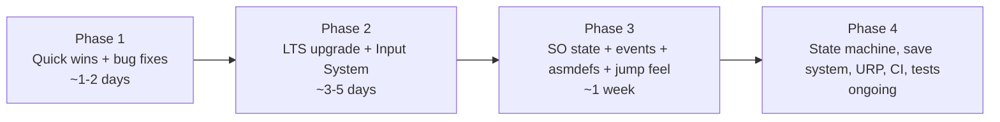

> **⚠️ SUPERSEDED / ARCHIVED (2026-07-10).** Content redistributed: the phased/wave
> sequence is superseded by `docs/production/Roadmap.md`; the architecture & refactor
> targets moved to `docs/technical/Architecture.md`. Kept here for history.

# Modernization Roadmap

Assumes the project continues active development for several years. Given the tiny
codebase (703 LOC, 16 scripts), most items are **cheap relative to a normal Unity
project** — the low LOC is the single biggest asset here.

## Guiding principles
1. Get onto a supported Unity LTS first (unlocks everything else).
2. Prefer incremental, testable steps over a big rewrite.
3. Adopt ScriptableObject + event architecture as the backbone.

---

## ⚡ Quick Wins (hours–1 day each)

| Item | Why | Notes |
|------|-----|-------|
| Remove unused packages/modules | Slims manifest & builds | Ads, Analytics, Purchasing, PackageManagerUI, collab-proxy, vehicles/cloth/terrain/vr/xr/wind/ai |
| Delete dead code | Clarity | `using Playables`, empty `Start/Update`, `ScenePersist.startingSceneIndex`, unreachable `MovingPlatform.Destroy` |
| Fix `PlayerPrefsController.SetDifficulty` copy-paste bug | Correctness | Writes volume instead of difficulty |
| Fix `LevelLoader` double-`FindObjectOfType` teardown | Prevents NRE | Cache the reference before destroying |
| Add named-scene constants / remove `LoseScreen` reference | Prevents broken loads | Replace magic index math |
| Player-identity checks in triggers | Fixes coin/exit/platform bugs | Tag or `IPlayer` marker |
| Cache `FindObjectOfType` results | Perf | Especially `OptionsControllers.Update` (per-frame) |
| Add a LICENSE + verify asset licenses | Legal hygiene | Before any distribution |

## 🛠️ Medium-Term Improvements (days)

| Item | Why | Effort |
|------|-----|:------:|
| **Upgrade to a supported Unity LTS** | Support, tooling, security | M |
| **Input System migration** (replace CrossPlatformInput) | Deprecated dependency; rebindable input; gamepad | M |
| **Assembly definitions + namespaces** (`Core`/`Gameplay`/`UI`) | Modularity, faster compiles, test seams | S–M |
| **ScriptableObject game state** (lives/score) | Decouples HUD from `GameSession` lifecycle; fixes stale-ref risk | M |
| **Event architecture** (C# events or SO-events for death/score/level-complete) | Kills the `FindObjectOfType` web | M |
| **Singleton base class / service locator** | Removes 4 duplicated singleton bodies | S |
| **Jump-feel package** (coyote/buffer/variable height) | Biggest gameplay payoff | S–M |
| **Checkpoint system** | Fairer respawns | M |
| Swap vendored 2d-extras → `com.unity.2d.tilemap.extras` package | Maintained | S |
| **Object pooling** for coins/SFX (`PlayClipAtPoint`) | Fewer allocations | S |

## 🏗️ Long-Term Refactors (weeks, as the game grows)

| Item | Why |
|------|-----|
| Player **state machine** (Grounded/Air/Climb/Dead) | Replace flat `Update` if-chain; enables dash/wall-jump cleanly |
| Enemy base class + `IDamageable`/`IHazard` interfaces | Add enemy variety without editing existing code |
| Proper **SceneFlowManager** (async loads, loading screen, level metadata SO) | Scalable level progression; kills index coupling |
| **Save system** (JSON/binary save file for progress, unlocks, high score) | Real persistence beyond PlayerPrefs volume |
| **AudioMixer** + routed SFX/music groups | Real audio control; SFX currently bypasses volume |
| **URP 2D** with 2D lights | Modern look; day/night lighting matches the existing art direction |

## 🔮 Future-Proofing

| Area | Recommendation |
|------|----------------|
| **Automated testing** | Unity Test Framework EditMode tests for `PlayerPrefsController`, scoring, scene-flow logic once assemblies exist. PlayMode smoke test per level. |
| **CI/CD** | GitHub Actions + GameCI (`game-ci/unity-builder`) to build WebGL on push; deploy to GitHub Pages / itch.io. |
| **Profiling** | Establish a baseline with the Profiler post-upgrade; watch GC from `PlayClipAtPoint` and `FindObjectOfType`. |
| **Localization** | `com.unity.localization` if targeting multiple languages; currently all UI is English string literals. |
| **Accessibility** | Rebindable controls (comes with Input System), colorblind-safe hazard cues, adjustable difficulty (slider is already stubbed), optional reduced screen-shake/slow-mo. |
| **Addressables** | Only if content grows large; **not warranted at current scale**. |
| **Analytics/monetization** | Only re-add Ads/Analytics/IAP if there's a real plan; otherwise keep removed. |

---

## Sequenced plan

See `docs/executive-summary.md` for the consolidated phased roadmap with
value/effort framing.
