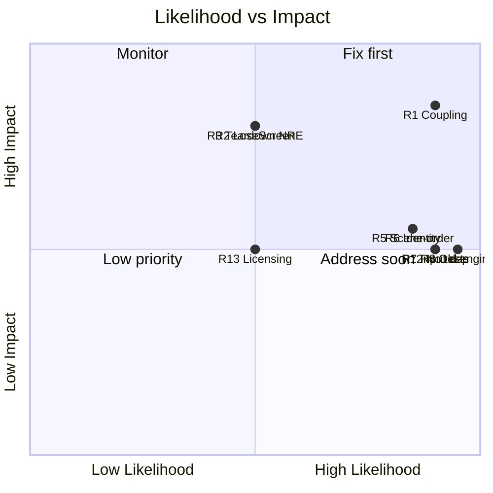

# Risk Assessment

> **Purpose:** Risk register (likelihood x impact) for correctness, maintainability and evolvability, with mitigation order.
> **Owner:** Franco Fusaro · **Status:** Living · **Last Updated:** 2026-07-10
> **Related:** [../technical/baseline/CodeReview](../technical/baseline/CodeReview.md), [Backlog](Backlog.md), [Roadmap](Roadmap.md)

Risks that threaten correctness, maintainability, or the ability to evolve the
project. Rated by **Likelihood × Impact**. "Impact" is scoped to a small hobby
project that intends to keep growing.

## Risk register

| # | Risk | Likelihood | Impact | Severity | Evidence |
|:-:|------|:----------:|:------:|:--------:|----------|
| R1 | **Hidden global coupling** via `FindObjectOfType` web | High | High | 🔴 | 11 call sites; every system reaches into others |
| R2 | **Broken scene reference** — `LoseScreen` doesn't exist | Med | High | 🔴 | `LevelLoader.LoadYouLoseScene` |
| R3 | **NRE in level teardown** — double `FindObjectOfType<ScenePersist>` after `Destroy` | Med | High | 🔴 | `LevelLoader.NextLevel`, `LoadMainMenu` |
| R4 | **Stale HUD references** — persistent `GameSession` holds scene-scoped TMP refs | Med | Med | 🟠 | `GameSession.livesText/scoreText` + `DontDestroyOnLoad` |
| R5 | **Scene-order coupling** — progression is `buildIndex + 1` math | High | Med | 🟠 | `LevelLoader`, no named-scene abstraction |
| R6 | **Fragile identity checks** — collider-type / tilemap-exit as identity proxies | High | Med | 🟠 | `CoinPickup` (`is CapsuleCollider2D`), `EnemyMovement`, `LevelExit` (no player check) |
| R7 | **Deprecated input dependency** — CrossPlatformInput | High | Med | 🟠 | `Player.cs` uses `CrossPlatformInputManager` |
| R8 | **Unsupported engine** — Unity 2018.3.0f2 | High | Med | 🟠 | `ProjectVersion.txt` |
| R9 | **Moving-platform re-parenting** — scale/jitter, parents any collider | Med | Med | 🟡 | `Platform.OnTriggerStay2D` |
| R10 | **Hardcoded values / magic numbers** — scene names, indices, layer strings | Med | Low | 🟡 | scattered string/int literals |
| R11 | **Silent stub bug** — `PlayerPrefsController.SetDifficulty` writes volume | Low | Low | 🟡 | copy-paste error; difficulty unused |
| R12 | **No tests / CI** — regressions undetectable | High | Med | 🟡 | no test folder, no workflow |
| R13 | **Legal/licensing** — third-party art/music, no LICENSE | Med | Med | 🟡 | asset inventory; distribution risk |
| R14 | **Dead dependencies** — Ads/Analytics/IAP unused but shipped | Low | Low | 🟢 | manifest vs. no code usage |

## Detail on the top risks

### R1 — Hidden coupling (the core architectural risk)
Nothing declares its dependencies. `FindObjectOfType` makes the object graph
implicit: a scene missing one manager fails silently at runtime, and any refactor
can break distant code with no compiler help. **Mitigation:** ScriptableObject
state + events + cached references (see `docs/technical/baseline/CodeReview.md` future architecture).

### R2 / R3 — Broken/fragile scene flow
`LoseScreen` load would throw; the double-lookup teardown can NRE when the object
was just destroyed. Both are latent (may not fire on the happy path) but are real
defects. **Mitigation:** a `SceneFlowManager` with named constants, existence
checks, and cached references before destroy.

### R4 — Lifecycle mismatch
The persistent `GameSession` outlives the scene whose HUD text it references. After
the first level, HUD writes may target destroyed objects while the new scene's
`GameSession` duplicate is destroyed by the singleton guard. **This is scene-setup
dependent — verify in the editor** (marked ASSUMPTION in level-architecture), but
the pattern is inherently risky. **Mitigation:** move state to a ScriptableObject
the HUD reads locally; keep managers stateless of scene UI.

### R6 — Fragile identity
Treating "has a CapsuleCollider2D" as "is the player" means any future capsule
collects coins; the level exit and platform parenting accept any collider.
**Mitigation:** a single `Player` tag / `IPlayer` component checked everywhere.

## Circular / structural dependencies
- No hard compile-time cycles (global namespace, no asmdefs), but a **runtime cycle
  of intent** exists: `Player → GameSession → LevelLoader → (reloads scene) →
  Player`. Harmless functionally but reflects the tangled ownership.
- `EnemyMovement`'s facing↔velocity relationship is self-referential (facing derives
  velocity in `Update`; `FlipSprite` derives facing from velocity) — works but fragile.

## Large classes / duplication
- No oversized classes (largest is `Player` at 155 LOC).
- **Duplication:** 4 hand-rolled singletons with subtly different bodies
  (`GameSession`, `ScenePersist`, `MusicPlayer`, `MenuMusic`) — consolidate.

## Risk heat map

## Recommended mitigation order
1. **R2, R3, R11** — fix the concrete bugs (hours).
2. **R6** — add player identity checks (hours).
3. **R8, R7** — LTS upgrade + Input System (days).
4. **R1, R4, R5** — SO state + events + SceneFlowManager (days–week).
5. **R12, R13** — add tests/CI and license hygiene (ongoing).
