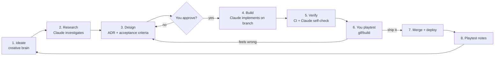
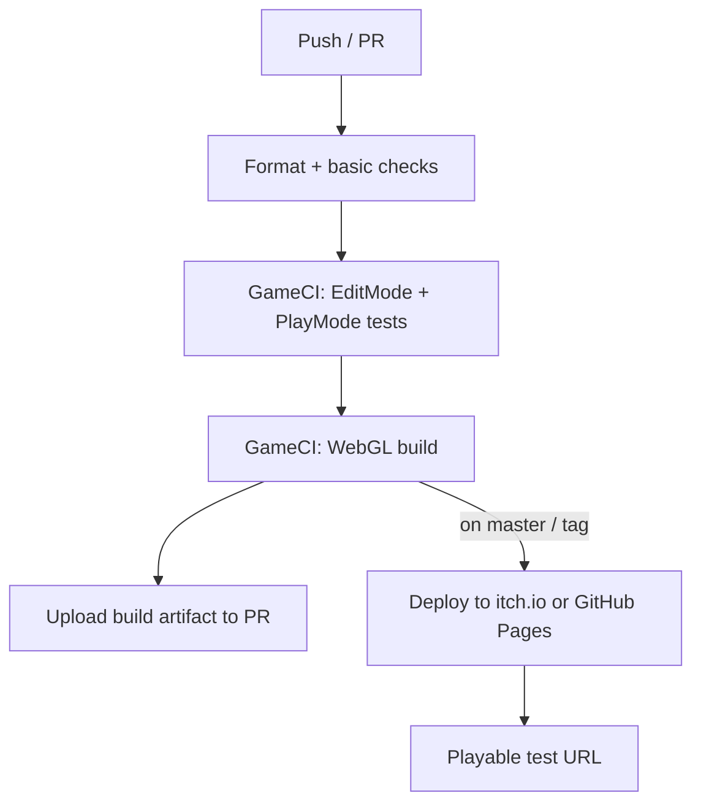

# Vibe-Coding Playbook — How We Build From Here

> **Purpose:** The operating manual: scaffolding, the research-to-ship dev cycle, and the CI/CD pipeline for this AI-built project.
> **Owner:** Franco Fusaro · **Status:** Living · **Last Updated:** 2026-07-10
> **Related:** [Roadmap](Roadmap.md), [../decisions/DECISION_LOG](../decisions/DECISION_LOG.md), [../README](../README.md)

This is the operating manual for continuing CatPlatformer as a **95% AI-built
project**, where **you are the creative director and approver** and Claude does the
implementation. It answers three things:

1. **What files/scaffolding are we missing** to work this way effectively.
2. **The development cycle** (research → plan → build → verify → ship) we'll follow.
3. **The CI/CD pipeline** to test and deploy each change.

It ends with how the **master plan** will be structured so we can start.

---

## Part 1 — What We're Missing (scaffolding to create)

The repo today is *just the game*. To vibe-code safely and fast, we need a thin
layer of process/config files so that (a) you always know what's happening, (b)
changes are testable, and (c) nothing silently breaks. Grouped by priority.

### 🔴 Tier 1 — Create first (unlocks the whole workflow)

| File | Why we need it |
|------|----------------|
| `CLAUDE.md` (repo root) | The single most important file. Claude reads it every session: coding conventions, "how this project works", guardrails ("never commit to master", "always keep MainMenu as build index 0"), and pointers into `docs/`. Prevents re-deriving context each time. |
| `docs/DECISIONS/` (ADRs) | One short markdown per meaningful decision (e.g. "ADR-0001: adopt ScriptableObject events"). Your approval trail; keeps the "why" out of your head. |
| `.github/workflows/ci.yml` | GameCI build + test on every push/PR (see Part 3). Turns "did it break?" into a green/red check. |
| `docs/production/Backlog.md` (or GitHub Issues) | The living list of features/mechanics/ideas. Source of truth for what's next. |
| `.editorconfig` | Enforces C# formatting so every AI-written file looks identical. Zero-effort consistency. |
| `LICENSE` | You legally need one before sharing; also gates the third-party-asset question. |

### 🟡 Tier 2 — Create as we start building

| File | Why |
|------|-----|
| `Assets/Tests/` + `.asmdef` (EditMode + PlayMode) | Where the automated tests live. Requires assembly definitions (Phase 2 of modernization). |
| `Assets/Scripts/*.asmdef` (`Core`, `Gameplay`, `UI`) | Enables tests, faster compiles, enforced dependency direction. |
| `.github/ISSUE_TEMPLATE/feature.md` + `bug.md` | Forces every idea through the same "research → design → acceptance criteria" shape. |
| `.github/pull_request_template.md` | Every change states: what, why, how tested, screenshots/gif. Your review checklist. |
| `CONTRIBUTING.md` | The human-readable version of the workflow (this doc is the deep version). |
| `docs/design/Vision.md` | The living design bible: the fantasy, the pillars, mechanics list, level themes. Your creative brain, written down. |
| `docs/CHANGELOG.md` | Player-facing "what changed" per version. |

### 🟢 Tier 3 — Nice to have as the project grows

| File | Why |
|------|-----|
| `.github/workflows/deploy.yml` | Auto-deploy WebGL to itch.io / GitHub Pages on tagged release. |
| `docs/screenshots/` | Real captures to replace README placeholders. |
| `.vscode/` or Rider settings | Shared editor config. |
| `Directory.Build.props` / analyzers | Roslyn analyzers to catch smells automatically. |
| `docs/PLAYTEST_NOTES.md` | Your running notes after each play session — feeds the backlog. |

> I can scaffold **all of Tier 1 (and the Tier-2 asmdefs/tests) in one pass** on a
> branch whenever you say go. See "Getting started" at the bottom.

---

## Part 2 — The Development Cycle

A repeatable loop per feature/mechanic. It's deliberately front-loaded on
**research + planning** because that's where your creative input has the most
leverage and where AI-built code most often goes wrong without direction.



### Stage-by-stage

**1. Ideate (you).** Drop an idea in `docs/production/Backlog.md` or just say it: "cats should
be able to dash", "add a snow level", "the jump feels floaty". No structure required.

**2. Research (Claude).** Before writing code, I investigate: how does this mechanic
work in reference platformers, what does our current code support, what are 2–3
implementation options with trade-offs, what assets would we need. Output: a short
research note. *This is where "vibe" gets grounded in feasibility.*

**3. Design (Claude → you approve).** I write a mini-spec / ADR:
- The change in one paragraph.
- **Acceptance criteria** (bullet list of observable behaviors — this is what we test against).
- Files touched, new assets needed (with PixelLab prompts if art is involved).
- Risks / what could break.
You approve, tweak, or reject. **Nothing gets built without an approved acceptance list.**

**4. Build (Claude on a branch).** Never on `master`. Small, reviewable commits. I
follow `CLAUDE.md` conventions and the target architecture (SO + events).

**5. Verify (automated + Claude).** CI runs build + tests. I self-review against the
acceptance criteria and run the `/verify` and `/code-review` skills. If it's a
runtime-visible change, I produce a build or describe how to see it.

**6. Playtest (you).** You get a WebGL build (from CI) or a gif and check *feel* —
the one thing automation can't judge. This is your core role.

**7. Ship.** Merge PR → CI deploys the new WebGL build to the test URL.

**8. Playtest notes → back to ideate.** Notes feed the next loop.

### Cadence options (pick per feature)
- **Fast lane** (small tweaks, art swaps, tuning): skip formal ADR, go idea → build → playtest.
- **Full lane** (new mechanic, architecture change): the whole loop with an ADR.

### Where your approval gates sit
1. After **Design** (before any code).
2. After **Playtest** (before merge/deploy).
Everything between those two is mine to run autonomously.

---

## Part 3 — CI/CD Pipeline

Goal: every push is **built and tested automatically**, and every merge to `master`
produces a **playable WebGL build you can open in a browser**. Uses **GameCI**
(the standard open-source Unity CI, free for public repos).



### What each stage does
- **Format/checks:** `.editorconfig`/`dotnet format` — catches style drift.
- **Tests:** `game-ci/unity-test-runner` runs EditMode (logic: scoring, PlayerPrefs,
  scene-flow) + PlayMode (a per-level smoke test that loads each scene and asserts no
  exceptions). Requires the `Assets/Tests` asmdefs from Tier 2.
- **Build:** `game-ci/unity-builder` targets **WebGL**, uploads the build as a PR
  artifact so you (or I) can download and play any branch.
- **Deploy (chosen: GitHub Pages):** on merge to `master`, publish the WebGL build
  to **GitHub Pages** via `actions/deploy-pages` → a stable public URL you open to
  playtest. (itch.io via `butler` remains the fallback if we later want private builds.)

### Local testing (no cloud needed)
For fast iteration you don't have to wait on CI:
- **In-editor:** open `Assets/Levels/MainMenu.unity`, press Play. Fastest loop.
- **Local WebGL:** `File → Build → WebGL`, then `python3 -m http.server 8080` in the
  build folder and open `localhost:8080` (WebGL can't run from `file://`).
- I can drive/verify changes with the `/run` and `/verify` skills where applicable.

### Requirements / gotchas
- GameCI needs a **Unity license** secret (free Personal license activation) stored in
  GitHub Actions secrets. One-time setup.
- WebGL builds are slow (~10–20 min) on CI — fine for merges, use local builds for iteration.
- **GitHub Pages (chosen):** enable Pages in repo settings (source = GitHub Actions).
  No third-party secret needed. The build URL is **public**.

---

## Part 4 — How the Master Plan Will Work

Once the scaffolding above exists, the master plan is just an **ordered, living
backlog** layered on top of the existing modernization roadmap. Structure:

```
docs/design/Vision.md      → the vision & pillars (your creative brain)
docs/production/Backlog.md          → prioritized epics → features → tasks
docs/DECISIONS/          → why we chose each approach (ADRs)
docs/modernization-*.md  → the technical foundation work (already written)
```

**Sequencing principle:** stabilize the foundation *just enough* to build safely,
then alternate **"foundation"** and **"fun"** work so you always have something new
to play:

- **Wave 0 — Make it safe to vibe-code** (scaffolding + Phase 1 bug fixes + CI). ~2–3 days. *No new gameplay, but everything after is faster and reversible.*
- **Wave 1 — Foundation + first fun** (asmdefs + SO/events + **jump-feel overhaul**). You immediately feel the game play better.
- **Wave 2 — Depth** (HP/hearts + checkpoints + enemy stomp).
- **Wave 3 — Content** (new levels/biomes, PixelLab art passes, new mechanics from the backlog).
- **Wave 4 — Polish & release** (URP 2D lighting, audio mixer, deploy pipeline, playtest cycles).

Each wave is a set of dev-cycle loops (Part 2). You approve at the design and
playtest gates; I do the rest.

---

## Getting Started (proposed first move)

When you're ready, say the word and I'll, on a fresh branch:
1. Scaffold **Tier 1** files (`CLAUDE.md`, `.editorconfig`, `LICENSE`,
   `.github/workflows/ci.yml`, `docs/production/Backlog.md`, `docs/DECISIONS/ADR-0000-template.md`).
2. Draft `docs/design/Vision.md` from what the game currently is, for you to edit.
3. Open a PR so you can review the whole setup before anything touches `master`.

Then we pick the first backlog item and run the loop.

### Decisions made (2026-07-05)
1. **Deploy target: GitHub Pages.** CI will publish the WebGL build to a GitHub
   Pages URL on merge to `master`. Note: Pages is **public** — fine for solo
   playtesting; revisit if we want private builds before release.
2. **Unity: upgrade to an LTS as part of Wave 0.** The engine upgrade happens up
   front (cheap now while the codebase is tiny), before we build new gameplay.
   Consequence: Wave 0 also folds in the Input System migration and package updates
   from `docs/technical/baseline/DependencyAudit.md`, and every level gets a post-upgrade playtest.
3. **Scaffolding: not yet.** Documentation only for now; Tier 1 files will be created
   when you give the go-ahead.

### Revised Wave 0 (given the decisions above)
1. Branch; open in target **Unity LTS**; fix compile errors; migrate input off
   CrossPlatformInput → **Input System**; swap vendored 2d-extras → package.
2. Phase 1 bug fixes (LoseScreen, teardown NRE, `SetDifficulty`, jump `+=`→`=`, identity checks).
3. Scaffolding (Tier 1) + GitHub Pages CI/deploy.
4. Full playtest of all 4 levels on the new engine.

> When ready, just say "scaffold Tier 1" (or "start Wave 0") and I'll open the PR.
