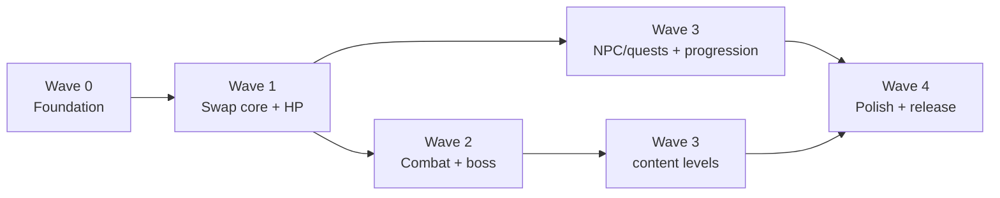

# Master Build Plan — Two Cats

> **Purpose:** The single authoritative wave-by-wave build plan (Wave 0 to 4) with review gates. Start here before any build session.
> **Owner:** Franco Fusaro · **Status:** Living · **Last Updated:** 2026-07-10
> **Related:** [Milestones](Milestones.md), [Backlog](Backlog.md), [Playbook](Playbook.md), [../design/Vision](../design/Vision.md)

> **This is the single authoritative "what we build, in what order" doc.** It folds the
> technical modernization waves together with the `docs/design/Vision.md` vision. Start here
> before any build session. Supersedes the scattered wave/phase lists in
> `docs/production/Playbook.md`, `docs/technical/Architecture.md`, and `docs/technical/baseline/LegacyAssessment.md`
> (those remain as detail references).
>
> **Current status:** 🟢 **Wave 0 in progress.** Done: **0.5** scaffolding (`CLAUDE.md`,
> `.editorconfig`, `LICENSE`, `docs/production/Backlog.md`, `docs/adr/` template + ADR-0001) and
> **0.6** CI/CD workflow (`.github/workflows/ci.yml`; won't go green until the LTS upgrade).
> **0.1 LTS upgrade done (2026-08-15):** Editor-driven upgrade to **Unity 6000.5.8f1**
> (ADR-0001, Accepted); compile errors fixed; all 4 levels + MainMenu/OptionsMenu/Success
> playtested clean on the new engine, 🚦 gate passed.
> **0.2 Input System migration done (2026-08-15):** `Player.cs` moved off the deprecated
> `CrossPlatformInput` Standard Asset onto `UnityEngine.InputSystem` (code-only `InputAction`s,
> no asset); vendored `CrossPlatformInput` folders deleted; `activeInputHandler` set to Both
> so legacy-`StandaloneInputModule` menus keep working unchanged. **Next (needs Unity Editor,
> yours to run):** playtest 0.2, then 0.3 package swaps. Then I do 0.4 bug fixes + 0.7 asmdefs.
> Detail in `docs/production/Backlog.md`.

## How to use this
- Each **Wave** is a milestone that ends in something you can **play and approve**.
- Inside a wave we run the dev cycle from `docs/production/Playbook.md` §2 (research → design →
  build → verify → **you playtest** → ship).
- **Your gates** are marked 🚦 — nothing past a gate proceeds without your approval.
- Effort estimates assume ~95% AI-built with you reviewing. They're rough.

---

## 🌊 Wave 0 — Foundation *(no new gameplay; makes everything after safe & fast)*
**Goal:** a modern, stable, tested base with a one-click playable build.

| # | Deliverable | Ref |
|---|-------------|-----|
| 0.1 | ✅ Branch; upgrade **Unity 2018.3 → 6000.5.8f1**; fix compile errors | `docs/technical/baseline/DependencyAudit.md`, ADR-0001 |
| 0.2 | ✅ Migrate input **CrossPlatformInput → Input System** | `docs/technical/baseline/DependencyAudit.md` |
| 0.3 | Swap vendored **2d-extras → package**; remove unused packages/modules | `docs/technical/baseline/DependencyAudit.md` |
| 0.4 | **Phase-1 bug fixes:** LoseScreen, teardown NRE, `SetDifficulty`, jump `+=`→`=`, player-identity checks | `docs/technical/baseline/CodeReview.md`, `docs/production/KnownRisks.md` |
| 0.5 | **Scaffolding (Tier 1):** `CLAUDE.md`, `.editorconfig`, `LICENSE`, `docs/production/Backlog.md`, ADR template | `docs/production/Playbook.md` §1 |
| 0.6 | **CI/CD:** GameCI build + test on push → **deploy WebGL to GitHub Pages** on merge | `docs/production/Playbook.md` §3 |
| 0.7 | **Assembly definitions** (`Core`/`Gameplay`/`UI`) + first EditMode test | `docs/technical/Architecture.md` |

**🚦 Gate:** you play the *existing* game on the new engine at the Pages URL, confirm all 4
levels still work. **Exit criteria:** green CI, playable build, no regressions.
**Effort:** ~4–6 days (the LTS upgrade is the riskiest single step — done in isolation).

---

## 🌊 Wave 1 — The core game becomes real *(the pillar)*
**Goal:** the two-cat swap loop is playable in one test level. This is where `docs/design/Vision.md`
stops being a doc and becomes a game. Full technical architecture (systems, events, folder/asmdef
plan, legacy migration, build order): `docs/technical/Wave1Architecture.md`. Atomic, ordered
implementation tasks: `docs/production/Wave1Backlog.md`. Debug tools/cheats/logging/metrics
needed to playtest it productively: `docs/technical/Wave1PlaytestInfrastructure.md`.

| # | Deliverable | Ref (GAME_DESIGN §) |
|---|-------------|---------------------|
| 1.1 | `ActiveCatManager` + `CatController` (one script, both cats) | §5, §15 |
| 1.2 | **Instant [SWAP]** + camera retarget (Cinemachine) | §14.1 |
| 1.3 | **Persistent partner:** follow AI + teleport-recover; puzzle-room gate that disables it | §5, §8 |
| 1.4 | **Ability system:** `CatAbility` components + one **grant API** (pickup/mentor/quest) | §6, §10.5, §15 |
| 1.5 | Starting kit: Orange **Zoomies + Wall-cling**, Tuxedo **Glide + Loaf** | §6 |
| 1.6 | **HP + down/revive** (per-cat), replacing one-hit lives | §10 |
| 1.7 | One **greybox test level**: flow corridor → co-op puzzle room → flow | §8, §11 |

**🚦 Gate (the big one):** you play the greybox level and judge whether the **swap + flow +
one puzzle** *feels* right. This is the make-or-break feel check. Expect iteration here.
**Effort:** ~1–1.5 weeks.

---

## 🌊 Wave 2 — Combat & depth
**Goal:** enemies, the stun→DPS combat loop, and the first boss.

| # | Deliverable | Ref |
|---|-------------|-----|
| 2.1 | `IDamageable` + basic enemies; **armored enemy** that forces a swap | §7, §9 |
| 2.2 | Combat abilities: Orange dash-combo DPS, Tuxedo **Flop** stun/AoE | §6, §9 |
| 2.3 | **First boss:** stun→DPS loop in an arena (reuses puzzle-room gate) | §9 |
| 2.4 | **[RECALL/TOSS]** verb + carry/hand-off item mechanic | §10.5, §14.1 |
| 2.5 | Checkpoints + death/respawn flow on the new HP model | §10 |

**🚦 Gate:** you clear the first boss and confirm combat feels like an extension of the swap,
not a bolted-on mini-game. **Effort:** ~1.5–2 weeks.

---

## 🌊 Wave 3 — Content, progression & world
**Goal:** the game grows from a vertical slice into an actual game.

| # | Deliverable | Ref |
|---|-------------|-----|
| 3.1 | **NPC/quest system** (data-driven, personality-gated) + the bird quest | §10.5, §12.2 |
| 3.2 | Ability **unlocks** wired to found/taught/earned sources | §10.5 |
| 3.3 | **PixelLab art pass:** Orange + Tuxedo sprite kits, new ability anims, hearts UI | `docs/design/art/StyleGuide.md` |
| 3.4 | 2–3 real levels with the flow→puzzle→boss rhythm; a biome/theme | §11 |
| 3.5 | Coins/yarn currency + **cosmetics** | §10.5 |
| 3.6 | (Optional) first **solo-cat** section | §12.1 |

**🚦 Gate:** you play a themed level start-to-finish with real art and one quest-unlock.
**Effort:** ongoing / content-scaling.

---

## 🌊 Wave 4 — Polish & release
**Goal:** ship-quality feel and a public build.

| # | Deliverable | Ref |
|---|-------------|-----|
| 4.1 | **URP 2D** + lighting (day/night art already exists) | `docs/technical/Architecture.md` |
| 4.2 | **AudioMixer** + routed SFX/music; SFX through master volume | `docs/technical/baseline/PerformanceReview.md` |
| 4.3 | Perf pass (pooling, cached lookups, atlas/audio compression for WebGL) | `docs/technical/baseline/PerformanceReview.md` |
| 4.4 | Menus/pause/options polish; accessibility (rebinding, difficulty) | `docs/technical/Architecture.md` |
| 4.5 | Tagged release → auto-deploy; `CHANGELOG.md`; screenshots | `docs/production/Playbook.md` |

**🚦 Gate:** public playtest build. **Effort:** ongoing.

---

## Dependency chain (why this order)

- **W0 must be first** — you can't safely build new systems on the deprecated engine/input.
- **W1 is the linchpin** — the ability-grant API, swap, and HP it establishes are what W2/W3 plug into.
- W2 (combat) and W3 (progression) can partly overlap once W1's ability system exists.

## Tooling & automation philosophy — *extract, don't front-load*

Tooling has a cost (maintenance surface, indirection, trust). For a solo, ~95%-vibecoded
project the main conversation + `CLAUDE.md` + **built-in** skills carry most of the load.
So: **build custom tooling by extracting it from a pattern we've already done ~twice — never
speculatively.**

| Tooling | Decision | When |
|---------|----------|------|
| **`CLAUDE.md`** | ✅ Build | Wave 0 (0.5) — context anchor, conventions, guardrails |
| Hooks + permission allowlist (`settings.json`) | ✅ Build (cheap) | Wave 0 — e.g. pre-commit test run, fewer prompts |
| Built-in skills (`/code-review`, `/verify`, `/run`) | ✅ Use as-is | Always; let `/verify` bootstrap a project verify skill |
| **`/new-ability`** custom skill | 🔜 Extract | After hand-building the 1st `CatAbility` in Wave 1 |
| **`/new-level`** custom skill | 🔜 Extract | After the 1st greybox level in Wave 1 |
| Custom subagents | ❌ Not as infrastructure | Use built-in `Explore`/`Plan` on-demand only when a task fans out |

> The two 🔜 skills get logged in `docs/production/Backlog.md` when it's created in step 0.5, tagged
> "extract when pattern repeats" — so we don't forget, but don't build early.

### Plugins / external integrations
Same lean rule: **no speculative plugin bundles.** Built-ins cover the workflow, and a
plugin is someone else's guess at it plus a trust/maintenance surface. **One exception worth
evaluating** when we hit editor-heavy work (the Wave 0 upgrade / Wave 1 scene & prefab setup):
a **Unity Editor ↔ Claude MCP bridge**, because the real bottleneck is that scenes/prefabs
can only be edited in the Editor today (I otherwise edit YAML blind). Value: inspect the
scene hierarchy, wire prefabs, read the console, trigger builds. Cost: setup + a
trust/security review of a community-maintained server. **Evaluate on-demand, don't install now.**

## Design decisions already locked (see `docs/design/Vision.md` §17)
Persistent-partner hybrid · flowing action + puzzle/boss punctuation · Orange + Tuxedo ·
combat = 3rd swap expression · HP + down/revive · abilities found/learnt not bought ·
personality-NPC quests · **instant swap + separate recall/toss**.

## Open items (decide while building, not now)
Boss timing/phases · revive cost · NPC centrality (light-touch default) · swap-throw tuning.

## Cross-references
Vision → `docs/design/Vision.md` · Process/CI → `docs/production/Playbook.md` · Tech detail →
`docs/technical/Architecture.md`, `docs/technical/baseline/CodeReview.md`, `docs/technical/baseline/DependencyAudit.md` · Art → `docs/design/art/StyleGuide.md`.
