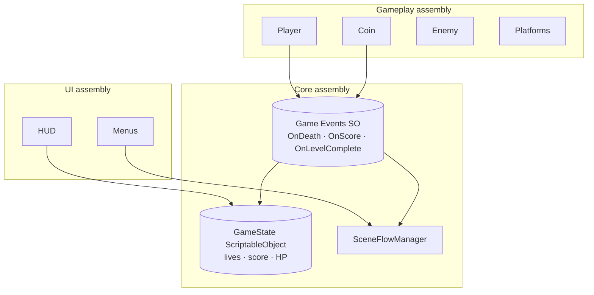

# Architecture — Target Design

> **Purpose:** The target code architecture (ScriptableObject state + events + assemblies) and how the Two-Cats design maps onto it. The "will build" counterpart to the as-built CodeReview.
> **Owner:** Franco Fusaro · **Status:** Living (target) · **Last Updated:** 2026-07-10
> **Related:** [baseline/CodeReview](baseline/CodeReview.md), [UnityStructure](UnityStructure.md), [SceneManagement](SceneManagement.md), [AI](AI.md), [../design/CoreLoop](../design/CoreLoop.md), [../production/Roadmap](../production/Roadmap.md), [Wave1Architecture](Wave1Architecture.md)

The as-built architecture and concrete defects are in
[baseline/CodeReview](baseline/CodeReview.md). This doc is the **target** we migrate
toward, plus how the [Design Bible](../design/Vision.md) maps onto the build.

## Target architecture (from CodeReview § Suggested Future Architecture)

- **ScriptableObject state + events** decouple producers (Player/Coin) from consumers
  (HUD/SceneFlow) — the idiomatic modern Unity pattern and an incremental migration from
  today's `FindObjectOfType` web.
- **Assembly definitions** (`Core`, `Gameplay`, `UI`) enforce dependency direction and
  unlock EditMode/PlayMode tests.
- **New Input System** replaces vendored CrossPlatformInput.

Estimated effort to reach this target from today: **~2–4 focused days** (codebase is
only 703 LOC). Sequencing is in [../production/Roadmap](../production/Roadmap.md).

## Modernization refactor targets

Consolidated from the modernization plan (superseded husk archived):

**Medium-term**
- Assembly definitions + namespaces (`Core`/`Gameplay`/`UI`).
- ScriptableObject game state (lives/score/HP) — fixes stale-HUD-ref risk.
- Event architecture (C# events or SO-events for death/score/level-complete).
- `Singleton<T>` base / service locator — removes 4 duplicated singleton bodies.
- Cache `FindObjectOfType` results; cache `LayerMask` ints.

**Long-term (as the game grows)**
- Player **state machine** (Grounded/Air/Climb/Dead) — enables dash/wall-jump cleanly.
- Enemy base class + `IDamageable`/`IHazard` interfaces.
- Proper **SceneFlowManager** (async loads, level metadata SO) — see [SceneManagement](SceneManagement.md).
- **Save system** — see [SaveSystem](SaveSystem.md).
- **AudioMixer**; **URP 2D** with 2D lights (day/night art already exists).

## How the Two-Cats design maps to the build (GAME_DESIGN §15)

No new *architecture* beyond what the modernization plan already calls for — the design
was chosen to fit it:

- **Swap & follow:** `ActiveCatManager` + one `CatController` on both cats + a
  swappable `InactiveCatStrategy` (follow / teleport-recover; "absent" for solo levels).
  See [AI](AI.md) and [../design/gameplay/Movement](../design/gameplay/Movement.md).
- **Abilities:** small `CatAbility` components per cat (Zoomies, Loaf, Flop, Wall-cling…),
  granted through **one ability-grant API** so a pickup, a mentor, or a quest reward can
  all unlock the same way. Build the ability set to *grow at runtime* and to support a cat
  being *absent* (solo-cat levels), not just inactive.
- **NPCs/quests:** data-driven NPC definitions (affinity + quest + reward); NPCs query
  `ActiveCatManager` for the current cat.
- **Enemies/bosses:** `IDamageable`, enemies with phases + an `arena` flag reusing the
  puzzle-room teleport-gate.
- **Health:** per-cat HP + down/revive (new to Wave 1; replaces lives). See [../design/GameRules](../design/GameRules.md).
- **Backbone:** ScriptableObject state + events + assembly definitions.
- This is the **Wave 1 pillar**: *multi-cat controller + swap + ability system + HP*,
  built on the Wave 0 LTS/Input-System foundation.

Full system-by-system breakdown, dependency diagram, event list, folder/asmdef plan,
and the legacy migration table → [Wave1Architecture](Wave1Architecture.md).
