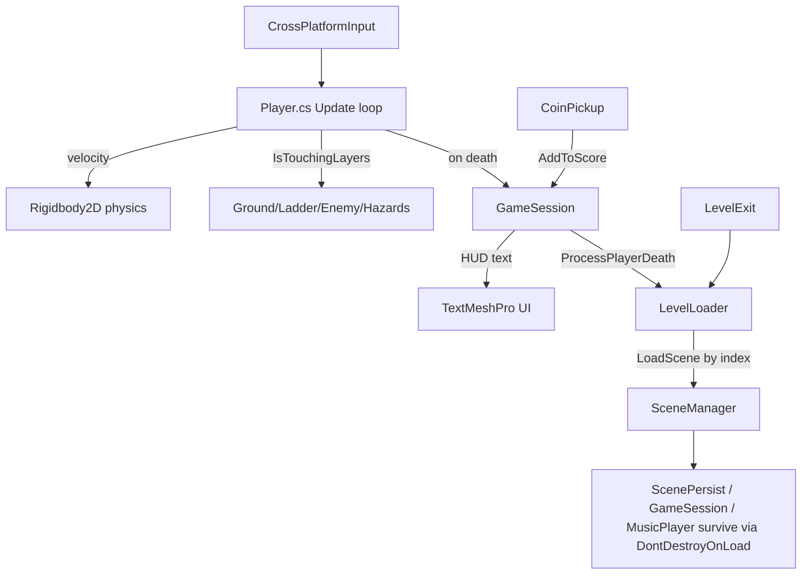

# Project Overview — CatPlatformer

> **Purpose:** Engine, pipeline, folder layout, packages, systems and entry points of the Unity project as it exists today.
> **Owner:** Franco Fusaro · **Status:** Baseline (as-built) · **Last Updated:** 2026-07-10
> **Related:** [Architecture](Architecture.md), [SceneManagement](SceneManagement.md), [baseline/](baseline/README.md)

> Technical assessment generated from source inspection. Evidence is cited as
> `path:symbol`. Items that could not be verified from source are marked
> **(ASSUMPTION)** or listed under **TODO (manual verification)**.

## 1. Purpose

CatPlatformer is a 2D side-scrolling platformer in which the player controls a
cat that runs, jumps, climbs ladders, collects coins, avoids enemies/hazards,
and reaches a level exit to progress. It is a small hobby / learning project
(single author, `bundleVersion: 0.1`) built on the classic Unity 2D toolchain.
The mechanics and code idioms strongly match the **GameDev.tv "Complete Unity
2D" course** lineage (`Player.cs`, `GameSession.cs`, `ScenePersist.cs`,
`PlayerPrefsController.cs` follow that course's naming conventions). **(ASSUMPTION)**

## 2. Engine, Pipeline & Build Targets

| Item | Value | Evidence |
|------|-------|----------|
| Unity version | **2018.3.0f2** | `ProjectSettings/ProjectVersion.txt` |
| Render pipeline | **Built-in (Legacy)** — no SRP/URP | `GraphicsSettings.asset: m_CustomRenderPipeline: {fileID: 0}` |
| Product name | CatPlatformer | `ProjectSettings.asset: productName` |
| Company | DefaultCompany (unset) | `ProjectSettings.asset: companyName` |
| Version | 0.1 | `ProjectSettings.asset: bundleVersion` |
| Primary build target | **WebGL** | `Build/Build.wasm.*`, `UnityLoader.js`, `index.html`, `TemplateData/` |
| Default resolution | 1024×768 (960×600 web) | `ProjectSettings.asset` |

A committed WebGL build lives in `Build/` with an `index.html` launcher at repo
root. This confirms the shipping target is browser/WebGL.

## 3. Folder Organization

```
Assets/
├── Scripts/            16 custom gameplay scripts (the entire game logic)
├── Levels/             7 scenes (menus + 4 playable levels + success)
├── Prefabs/            11 prefabs (Player, enemies, managers, pickups…)
├── Animations/         Animator controllers + .anim clips (cat, enemy, coin, camera)
├── Sprites & Tiles/    Sprite sheets + hundreds of TileBase .asset tiles
├── Materials/          Rendering materials
├── SFX/                Coin pickup sounds
├── Music/              5 background music tracks
├── Fonts/              "Caramel Candy" TTF + TMP SDF asset
├── Gizmos/Cinemachine/ Cinemachine editor gizmos
├── TextMesh Pro/       TMP package resources (vendored)
└── Standard Assets/    CrossPlatformInput + 2d-extras (vendored third-party)
```

Key observations:
- **All game logic is in `Assets/Scripts/` as 16 flat MonoBehaviours** (703 LOC total). No namespaces, no assembly definitions, no `Editor/` scripts of the project's own.
- `Standard Assets/` vendors two Unity-shipped packages: **CrossPlatformInput** (input abstraction, used by `Player.cs`) and **2d-extras-master** (RuleTile, AnimatedTile, custom brushes).
- The folder name `Sprites & Tiles` contains a space and an `&`; safe but requires quoting in shell tooling.

## 4. Packages & External Dependencies

From `Packages/manifest.json` (see `docs/technical/baseline/DependencyAudit.md` for full audit):

| Package | Version | Used? |
|---------|---------|-------|
| com.unity.cinemachine | 2.2.9 | **Yes** — camera follow (`Cameras.prefab`, State Driven Camera) |
| com.unity.textmeshpro | 1.3.0 | **Yes** — HUD lives/score text (`GameSession.cs`) |
| com.unity.ads | 2.3.1 | **No usage found in scripts** |
| com.unity.analytics | 3.2.2 | **No usage found** |
| com.unity.purchasing | 2.0.3 | **No usage found** |
| com.unity.collab-proxy | 1.2.15 | Editor collab (unused at runtime) |
| com.unity.package-manager-ui | 2.0.3 | Editor tooling |
| 2d-extras (vendored) | master snapshot | Tilemap RuleTile/brushes |
| CrossPlatformInput (vendored) | Standard Assets | **Yes** — all player input |

**Ads / Analytics / IAP are dependencies but dead weight** — no C# references them.

## 5. Main Systems

| System | Entry script(s) | Notes |
|--------|-----------------|-------|
| Player control | `Player.cs` | Walk/jump/climb/flip/die state machine in `Update()` |
| Session/state | `GameSession.cs` | Persistent (`DontDestroyOnLoad`) lives + score + HUD |
| Scene flow | `LevelLoader.cs`, `Menu.cs` | Loads levels by build index, slow-mo transitions |
| Scene persistence | `ScenePersist.cs` | Singleton object surviving reloads |
| Enemies | `EnemyMovement.cs` | Patrol rat, flips at tilemap edges |
| Platforms | `MovingPlatform.cs`, `Platform.cs` | Waypoint mover + parenting rider |
| Pickups | `CoinPickup.cs` | Coin → score + SFX |
| Level exit | `LevelExit.cs` | Trigger → next level |
| Camera | Cinemachine (`Cameras.prefab`) | State Driven Camera + parallax `LayerParallax.cs` |
| Audio | `MusicPlayer.cs`, `MenuMusic.cs` | Singleton random-track music player |
| Options/persistence | `OptionsControllers.cs`, `PlayerPrefsController.cs` | Volume slider → PlayerPrefs |

## 6. Entry Points

- **Runtime start:** `MainMenu` scene (build index 0). `Menu.cs:StartFirstLevel()` loads build index 1 (`Level 1`).
- **Build scenes (in order):** MainMenu → Level 1 → Level 2 → Level 3 → Level 4 → Success → OptionsMenu (`EditorBuildSettings.asset`).
- **WebGL launcher:** `index.html` → `UnityLoader.js` → `Build/Build.json`.

## 7. High-Level Data Flow



The architecture is **discovery-based**: components find each other at runtime
with `FindObjectOfType<T>()` rather than through injected references or an event
bus. This is the single most important architectural fact about the project and
is analyzed in `docs/technical/baseline/CodeReview.md` and `docs/production/KnownRisks.md`.

## 8. Cross-References

- Mechanics detail → `docs/technical/baseline/GameplayMechanics.md`
- Scene/flow graph → `docs/technical/baseline/LevelArchitecture.md`
- Code quality → `docs/technical/baseline/CodeReview.md`
- Assets → `docs/technical/baseline/AssetInventory.md`
- Dependencies → `docs/technical/baseline/DependencyAudit.md`
- Roadmap → `docs/technical/Architecture.md`, `docs/technical/baseline/LegacyAssessment.md`

## TODO (manual verification)
- [ ] Confirm whether Ads/Analytics/IAP are intended future features or leftover template cruft.
- [ ] Confirm `Success.unity` is the intended "win" screen and `LoseScreen` (referenced in code) actually exists — **no `LoseScreen.unity` file is present** (see code-review).
