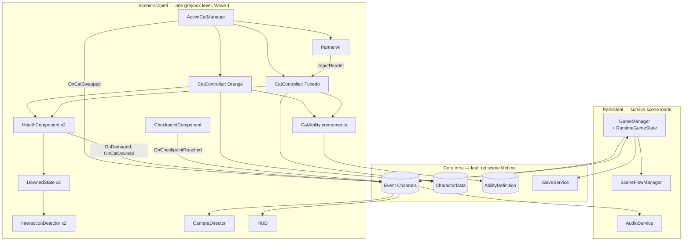

# Wave 1 Architecture — Swap Core, Abilities, HP

> **Purpose:** The concrete software architecture for Wave 1 (`docs/production/Roadmap.md`) — every system the two-cat swap, ability, and HP loop needs, how they're wired, and how the legacy scripts map onto them. The implementation-ready detail behind `docs/technical/Architecture.md`'s target diagram.
> **Owner:** Franco Fusaro · **Status:** Living (Accepted 2026-07-26 — see ADR-0002) · **Last Updated:** 2026-07-26
> **Related:** [Architecture](Architecture.md), [Wave1PlaytestInfrastructure](Wave1PlaytestInfrastructure.md), [AI](AI.md), [SceneManagement](SceneManagement.md), [SaveSystem](SaveSystem.md), [baseline/CodeReview](baseline/CodeReview.md), [../production/Roadmap](../production/Roadmap.md), [../design/Vision](../design/Vision.md), [../design/CoreLoop](../design/CoreLoop.md), [../design/gameplay/Abilities](../design/gameplay/Abilities.md), [../design/gameplay/Movement](../design/gameplay/Movement.md), [../design/GameRules](../design/GameRules.md), [../decisions/adr/0002-wave1-architecture](../decisions/adr/0002-wave1-architecture.md)

This doc is scoped to **Wave 1 only** — it does not invent mechanics, does not
touch Wave 2 combat/checkpoints-beyond-one, and does not redesign anything in
the Design Bible. Where a design doc leaves something open (revive cost, room-gate
ownership), this doc builds the seam and defers the value, it doesn't decide it.

## Contents

1. [Systems](#systems)
2. [Dependency diagram, init order, lifetime, ownership](#dependency-diagram-init-order-lifetime-ownership)
3. [Event architecture](#event-architecture)
4. [Folder structure](#folder-structure)
5. [Assembly definitions](#assembly-definitions)
6. [ScriptableObject strategy](#scriptableobject-strategy)
7. [Legacy migration](#legacy-migration)
8. [Technical risks](#technical-risks)
9. [Wave 1 implementation roadmap](#wave-1-implementation-roadmap)

---

## Systems

Eighteen systems, as requested. Two of them (**Swap System**, **Interaction-as-Revive**)
are called out explicitly but are **not separate classes** — see their entries for why;
building a class for every noun in the brief is exactly the over-engineering this doc is
supposed to push back on.

### GameManager

- **Purpose:** the single persistent session owner. Boots the game, holds the
  runtime source of truth, mediates flow that no single gameplay system should own
  (pause, both-cats-down, checkpoint restore).
- **Responsibilities:** own `RuntimeGameState` (see [ScriptableObject strategy](#scriptableobject-strategy)); run the boot sequence (see [init order](#dependency-diagram-init-order-lifetime-ownership)); own the `ISaveService` reference; listen for `OnCatDowned` x2 → `OnBothCatsDowned` → checkpoint restore; expose pause/resume.
- **Public API:**
  ```csharp
  RuntimeGameState State { get; }
  void RestartFromCheckpoint();
  void Pause(); void Resume();
  ```
- **Dependencies:** Event system (publishes `OnBothCatsDowned`, `OnGamePaused`/`OnGameResumed`; subscribes to `OnCatDowned`, `OnCheckpointReached`), `SceneFlowManager`, `ISaveService`.
- **Extension points:** later session-scoped systems (analytics, difficulty) register here without touching gameplay code.
- **Risks:** the obvious god-object risk. Mitigate with a hard rule: GameManager **orchestrates**, it never contains gameplay logic (no HP math, no swap logic) — those stay in their own systems and talk to GameManager only through events.

### ActiveCatManager

- **Purpose:** the single authority for "who is active, who is the partner, is a cat even present" — the object every other system queries instead of guessing.
- **Responsibilities:** hold both `CatController` refs (nullable — must support **absence**, not just inactivity, per [Tutorial.md](../design/levels/Tutorial.md)); validate and execute swap requests; own which `IInputReader` each `CatController` is currently driven by (see **Partner AI** — this is the mechanism, not a separate "Swap System" class); raise `OnCatSwapped`.
- **Public API:**
  ```csharp
  CatController ActiveCat { get; }
  CatController InactiveCat { get; }   // null if absent (solo-cat sections)
  bool TrySwap();
  void SetCatPresence(CatId id, bool present);
  void LockSwap(bool locked);          // reserved for a future hard-lock; Wave 1 doesn't need it (see Swap System note)
  ```
- **Dependencies:** both `CatController`s, Event system.
- **Extension points:** solo-cat presence toggle is already in the API even though solo levels are Wave 3+ scope — cheap to add now, expensive to retrofit into every caller later.
- **Risks:** swapping mid-ability (e.g. mid-dash) needs a per-`CatController` "can I be swapped away from right now" guard, or physics state gets orphaned. Add a single `bool CanRelinquishControl` check on `CatController` before `TrySwap` commits.

### CatController

- **Purpose:** the *one script, both cats* component from Roadmap 1.1 — generic locomotion driven entirely by injected data, never by cat identity.
- **Responsibilities:** read `IInputReader` (whichever one `ActiveCatManager` currently assigns it — human or AI, it doesn't know which); apply movement per `CharacterData` tuning; host `CatAbility` components as children/attached components and tick the active ones; track `LastSafeGroundedPosition` for teleport-recover; drive Animator via hashed params.
- **Public API:**
  ```csharp
  CharacterData Data { get; }
  bool IsActive { get; }              // am I the leader right now
  bool IsGrounded { get; }
  Vector2 LastSafeGroundedPosition { get; }
  bool CanRelinquishControl { get; }
  IReadOnlyList<CatAbility> Abilities { get; }
  ```
- **Dependencies:** `CharacterData` (SO), `IInputReader` (assigned, not owned), `CatAbility` components, `HealthComponent`.
- **Extension points:** a new cat is new `CharacterData` + a new ability set, **not** new controller code — this is the whole point of the data-driven split and is what keeps this file honest about "no new gameplay mechanics."
- **Risks:** the "one script, both cats" promise only holds if asymmetric behavior never leaks in here. **Rule, not a suggestion:** if a line of code would read differently for Orange vs. Tuxedo, it belongs in a `CatAbility` or in `CharacterData`, not in `CatController`. Flag any PR that violates this in review.

### CharacterData (ScriptableObject)

- **Purpose:** the designer-tunable, code-free identity of a cat (`Orange.asset`, `Tuxedo.asset`).
- **Responsibilities:** hold `walkSpeed`, `jumpForce`, `maxHP`, `animatorController`, `startingAbilities` (list of `AbilityDefinition`), `catId`. Nothing else — see the [footgun callout](#scriptableobject-strategy) for why it must stay read-only at runtime.
- **Public API:** plain serialized fields, read-only from gameplay code.
- **Dependencies:** none — it's a leaf. Read by `CatController`, `HealthComponent` (init max HP), `AbilityGrantService` (starting kit).
- **Extension points:** new stat fields as tuning needs grow; this is the only file that changes to add a third cat later (out of scope, just noting the headroom is free).
- **Risks:** the temptation to stash runtime state on it (current HP, unlocked flags) — don't. It's a shared asset; mutating it at runtime leaks across every instance and across Editor play sessions.

### Ability System

- **Purpose:** each verb (Zoomies, Wall-cling, Glide, Loaf) is an independent, composable component instead of a branch in a god-controller.
- **Responsibilities:** each `CatAbility` owns its own input handling, effect, and unlocked-state check; `CatController` just enumerates and ticks whichever abilities are unlocked and not exclusivity-blocked.
- **Public API:**
  ```csharp
  abstract class CatAbility : MonoBehaviour {
      AbilityDefinition Definition { get; }
      bool IsUnlocked { get; set; }
      bool TryActivate(IInputReader input);
      void Tick();
  }
  // concrete: ZoomiesAbility, WallClingAbility, GlideAbility, LoafAbility
  ```
- **Dependencies:** `CatController` (host), `IInputReader`, `CharacterData` (tuning), `AbilityDefinition` (SO metadata: name/icon/description/exclusivity-group).
- **Extension points:** this is **the** seam Wave 2's combat abilities (dash-combo DPS, the Flop) plug into — same base class, new subclasses, zero `CatController` changes.
- **Risks:** ability-vs-ability interaction (Loaf while gliding?) turning into ad-hoc `if` spaghetti. Mitigate with a simple `exclusivityGroup` tag on `AbilityDefinition` (e.g. "movement") that `CatController` uses to allow only one active ability per group — resist building a full state machine for four abilities.

### Ability Granting

- **Purpose:** the one grant API so a pickup, a mentor, and a quest reward can all unlock an ability identically (Roadmap 1.4, [Progression.md](../design/gameplay/Progression.md)).
- **Responsibilities:** `Grant` is idempotent, updates `RuntimeGameState`'s unlocked set, flips the matching `CatAbility.IsUnlocked` on the target cat, raises `OnAbilityUnlocked`.
- **Public API:**
  ```csharp
  void Grant(CatId cat, AbilityDefinition ability, GrantSource source);
  bool IsUnlocked(CatId cat, AbilityDefinition ability);
  enum GrantSource { StartingKit, Pickup, Mentor, Quest }
  ```
- **Dependencies:** `RuntimeGameState`, Event system, `CatController` (to flip the ability).
- **Extension points:** `GrantSource.Mentor`/`Quest` exist today even though NPCs are Wave 3 — the enum costs nothing now and saves an API break later. The **starting kit itself is granted through this same call at spawn** (`GrantSource.StartingKit`), not a special-cased bootstrap path — one mechanism, no duplicate code.
- **Risks:** scope creep into an actual quest system. This is Wave 1: `Grant()` and nothing upstream of it (no quest state machine, no NPC dialogue).

### Input Layer

- **Purpose:** one seam between the Input System (installed in Wave 0.2) and every gameplay consumer, so `CatController`/abilities never touch `InputAction` directly.
- **Responsibilities:** own the `InputActionAsset`; expose a small polled surface; route real input only to whichever `CatController` `ActiveCatManager` currently marks as human-driven.
- **Public API:**
  ```csharp
  interface IInputReader {
      float MoveAxis { get; }
      bool JumpDown { get; }
      bool SwapDown { get; }
      bool AbilityDown { get; }   // context-specific per active ability
      bool InteractDown { get; }
  }
  class PlayerInputReader : IInputReader { /* wraps InputAction callbacks */ }
  ```
- **Dependencies:** Input System package; consumed by `CatController`, `ActiveCatManager` (swap button), `AbilitySystem`, `InteractionDetector`.
- **Extension points:** the interface is what makes **Partner AI** possible for free (see below) and later enables rebinding/accessibility (Wave 4.4) and a scripted `IInputReader` for tests without touching consumers.
- **Risks:** if any script polls `Input`/`InputAction` directly instead of going through `IInputReader`, the abstraction is dead. Enforce via review, not tooling — not worth a Roslyn analyzer at this scale.

### Swap System

- **Purpose:** the instant control-flip (Roadmap 1.2). Called out separately in the brief, but architecturally it **is not a new class** — it's `ActiveCatManager.TrySwap()` plus a listener each on Camera Integration and Partner AI.
- **Why no dedicated class:** the entire "system" is: swap the `IInputReader` assignment between the two `CatController`s, flip `IsActive`, raise one event. That's a five-line method on an object (`ActiveCatManager`) that already owns both cats. A separate `SwapSystem` class would own no state of its own and exist purely to forward a call — the textbook case for *not* adding a type.
- **Responsibilities / API / dependencies:** see `ActiveCatManager` above.
- **Risks:** none beyond what's covered under `ActiveCatManager` (the mid-ability guard).

### Partner AI

- **Purpose:** drive the inactive cat's Follow / Teleport-recover / Absent behavior ([AI.md](AI.md), [Movement.md](../design/gameplay/Movement.md)).
- **Key architectural decision:** `PartnerAI` implements `IInputReader` and produces **synthetic input toward a follow target**, then gets assigned to the inactive `CatController` exactly the way `PlayerInputReader` gets assigned to the active one. The controller never knows or cares whether it's human- or AI-driven. This single decision is what makes "leader/follower symmetry" fall out for free instead of requiring a parallel follow-movement code path — it directly follows from Movement.md's own rule that *"the partner never replicates an ability in real time... abilities are leader-only, the partner reconciles position afterward"*: since `PartnerAI` only ever emits move/jump-style axis input, not ability-activation input, ability-leader-only-ness is automatic, not something to separately enforce.
- **Responsibilities:** steer toward the leader within the partner's own `CharacterData` limits; if too far behind/offscreen, teleport to `LastSafeGroundedPosition` (owned by `CatController`, populated whenever it's grounded outside a hazard layer); disable teleport-recover while `LockTeleportRecover(true)` is set (puzzle-room/arena gate) or while the cat is downed.
- **Public API:**
  ```csharp
  class PartnerAI : MonoBehaviour, IInputReader {
      void SetFollowTarget(Transform leader);
      void LockTeleportRecover(bool locked);
  }
  ```
- **Dependencies:** `ActiveCatManager` (leader ref), `CatController` (both), Event system (room enter/exit, downed/revived).
- **Extension points:** the steering algorithm (simple seek today) is swappable behind the same interface — [AI.md](AI.md)'s own TODO (waypoint-trail) is a drop-in replacement later, not a rewrite.
- **Risks:** naive "last safe grounded" bookkeeping teleporting a cat into a hazard right after it lands — guard the write with a hazard-layer check, not just a ground check.

### Health System

- **Purpose:** per-cat HP replacing legacy one-hit lives (Roadmap 1.6, [GameRules.md](../design/GameRules.md)).
- **Responsibilities:** track current/max HP per cat (initialized from `CharacterData.maxHP`); apply damage/heal; enforce the flow-invulnerable / arena-vulnerable partner rule by reading a `CombatContext` flag the current room raises (open trigger volume vs. arena — Wave 1 only needs the flag to exist and default to "flow," since armor/bosses are Wave 2).
- **Public API:**
  ```csharp
  class HealthComponent : MonoBehaviour {
      int Current { get; } int Max { get; }
      bool IsDowned { get; }
      void ApplyDamage(int amount, DamageSource source);
      void Heal(int amount);
  }
  ```
- **Dependencies:** `CharacterData` (max HP), Event system, `CombatContext` (room-scoped).
- **Extension points:** `DamageSource` is an enum today with one real value used (`Hazard`) so Wave 2's `IDamageable` enemies extend it, not replace it.
- **Risks:** none Wave-1-specific; keep it decoupled from Downed/Revive (below) so "HP hits 0" and "what happens next" aren't the same class.

### Downed/Revive System

- **Purpose:** "downed, not dead" plus revive-by-proximity ([GameRules.md](../design/GameRules.md)).
- **Responsibilities:** on `Current == 0`, disable input/abilities on that cat and enter a downed pose; expose itself as an `IInteractable` so the other cat can revive it by walking up and pressing interact — **this reuses the Interaction System rather than inventing a bespoke trigger**, which is the second "don't build a new class for this" call in this doc; if the *other* cat is also downed, `GameManager` catches `OnBothCatsDowned` and restarts from checkpoint.
- **Public API:**
  ```csharp
  class DownedState : MonoBehaviour, IInteractable {
      bool IsDowned { get; }
      void Down(); void Revive();
      // IInteractable
      bool CanInteract(CatController by) => IsDowned && by != owner;
      void Interact(CatController by) => Revive();
  }
  ```
- **Dependencies:** `HealthComponent`, Interaction System, Event system, `PartnerAI` (must disable teleport-recover for a downed cat — a downed cat teleporting to the leader mid-revive would be a visible bug).
- **Extension points:** revive cost/time is explicitly open in GameRules.md — the `Interact` call is a single point to add a hold-duration or resource cost later without touching anything else.
- **Risks:** covered above (teleport-recover interaction). Also: don't let this system decide "both down → checkpoint" itself — that's `GameManager`'s job, this system only reports state.

### Camera Integration

- **Purpose:** Cinemachine retarget on swap (Roadmap 1.2); single-target framing for solo-cat sections (future).
- **Responsibilities:** listen to `OnCatSwapped`, retarget the vcam's `Follow`/`LookAt`; let Cinemachine's own blending handle the transition — no hand-rolled camera lerp.
- **Public API:**
  ```csharp
  void FollowCat(CatController cat);
  ```
- **Dependencies:** Cinemachine package (already in the legacy project, proven), `OnCatSwapped`.
- **Extension points:** puzzle-room dual-cat framing and boss-arena framing are open (Wave 2/3) — flagged, not solved, here.
- **Risks:** low. Keep code-side to the one method above; resist building camera logic that Cinemachine already does.

### Checkpoint System

- **Purpose:** the restore point for both-cats-down (GameRules.md), replacing legacy full-scene-reload restarts.
- **Responsibilities:** a `CheckpointComponent` on a trigger volume raises `OnCheckpointReached(Vector2 position)` on touch (automatic, no interact prompt — see below for why this is deliberately *not* built on the Interaction System); `GameManager` records the latest one in `RuntimeGameState` and uses it to respawn both cats at full HP.
- **Public API:**
  ```csharp
  // CheckpointComponent: OnTriggerEnter2D → raises OnCheckpointReached
  Vector2 CurrentCheckpoint { get; }  // on RuntimeGameState
  ```
- **Scope call:** the Wave 1 greybox is one level (Roadmap 1.7) — ship **one checkpoint (level start)**, not a multi-checkpoint manager with ordering/furthest-reached logic. That complexity belongs to Wave 2+ when there's more than one level's worth of content to justify it.
- **Why not the Interaction System:** a checkpoint fires automatically on contact; interaction is "walk up, see a prompt, press a button." Routing an automatic trigger through a system built for player-initiated action would be indirection with no payoff.
- **Dependencies:** Event system, `GameManager`.
- **Extension points:** Wave 3's save-on-checkpoint hooks in exactly here (`GameManager` already owns `ISaveService`).
- **Risks:** none at Wave 1 scope, as designed above.

### Interaction System

- **Purpose:** the generic "walk up, press button" affordance — used by Downed/Revive now, by pickups/mentors/quest-givers later.
- **Responsibilities:** `IInteractable` contract; a per-cat `InteractionDetector` trigger that tracks the nearest interactable in range and calls `Interact` on button press; raises `OnInteractableFocusChanged` for the prompt UI.
- **Public API:**
  ```csharp
  interface IInteractable {
      bool CanInteract(CatController by);
      void Interact(CatController by);
      string Prompt { get; }
  }
  class InteractionDetector : MonoBehaviour { /* nearest-in-range + button */ }
  ```
- **Dependencies:** `IInputReader` (interact button), UI hooks (prompt).
- **Extension points:** exactly what Wave 2's item hand-off and Wave 3's NPCs plug into — deliberately built generic now because Downed/Revive already needs *a* version of it, so the marginal cost of the generic version over a one-off is close to zero.
- **Risks:** the opposite temptation — don't add dialogue trees, multi-step interactions, or interaction "types" now. Scope is exactly `CanInteract`/`Interact`/`Prompt`.

### Save abstraction (interface only)

- **Purpose:** make Wave 1 code save-ready without building a save file — [SaveSystem.md](SaveSystem.md) is explicitly `Status: Planned`, and this doc respects that.
- **Responsibilities:** none — no implementation ships in Wave 1 beyond a no-op.
- **Public API:**
  ```csharp
  interface ISaveService {
      void Save(SaveData data);
      SaveData Load();
      bool HasSave();
  }
  class NullSaveService : ISaveService { /* no-op; used until Wave 3 */ }
  struct SaveData {
      int schemaVersion;
      string checkpointId;
      List<(CatId, AbilityDefinition)> unlockedAbilities;
  }
  ```
- **Scope call:** `SaveData` deliberately does **not** carry cosmetics/currency fields yet, even though SaveSystem.md names them as eventual targets — those systems don't exist until Wave 3. Adding the fields now means guessing their shape before the feature is designed; add them when Collectibles/Progression actually ships. `schemaVersion` is in from day one specifically so that future addition is a migration, not a break.
- **Dependencies:** none inbound. `RuntimeGameState` is shaped to convert cleanly to/from `SaveData`, so swapping `NullSaveService` for a real `Application.persistentDataPath` JSON implementation in Wave 3 touches one registration line, not gameplay code.
- **Risks:** covered above (schema versioning).

### Event system

- **Purpose:** decouple producers (CatController, HealthComponent, GameManager) from consumers (Camera, Audio, UI) — extends `docs/technical/Architecture.md`'s existing SO-events direction with the concrete Wave 1 event set.
- **Responsibilities:** one typed channel per event (not one god-bus), each a `ScriptableObject` holding a runtime listener list that's populated in `OnEnable` and cleared in `OnDisable` — never persisted, never inspected as "data."
- **Public API:**
  ```csharp
  abstract class GameEventChannel<T> : ScriptableObject {
      public void Raise(T payload) => Listeners?.Invoke(payload);
      public event Action<T> Listeners;
  }
  // e.g. CatSwappedChannel : GameEventChannel<CatSwapEventArgs>
  ```
- **Dependencies:** none — leaf infra everyone else depends on.
- **Extension points:** a new event is a new channel asset; zero code coupling between the publisher and any future subscriber.
- **Risks:** stale listeners if a consumer forgets to unsubscribe in `OnDisable`. Mitigate by convention (documented here) plus one EditMode test (Wave 0.7 already sets the pattern) that raises each channel with zero listeners and asserts no exception — cheap insurance, not a framework.

### Audio hooks

- **Purpose:** reactive-but-decoupled audio, replacing the per-frame `FindObjectOfType<MusicPlayer>()` in `OptionsControllers` (CodeReview #1) and consolidating the two duplicate singleton music players.
- **Responsibilities:** one persistent `AudioService` subscribes to the events it cares about (`OnCatSwapped` → stinger, `OnCatDowned` → downed sting, `OnCheckpointReached` → chime) and exposes one-shot/volume calls for direct use.
- **Public API:**
  ```csharp
  void PlaySfx(AudioClip clip);
  void PlayMusic(AudioClip clip);
  void SetMasterVolume(float volume);  // keeps PlayerPrefsController's existing contract
  ```
- **Dependencies:** Event system; folds `MusicPlayer` + `MenuMusic` into one service (see [migration](#legacy-migration)).
- **Extension points:** AudioMixer routing is explicitly Wave 4.2 — Wave 1 only needs the event hookups and the volume contract, not the mixer.
- **Risks:** scope creep into a full audio pass. Wave 1 delivers "hooks exist, 2–3 real cues wired," nothing more.

### UI hooks

- **Purpose:** HUD reacts to events/state instead of being polled or discovered — fixes CodeReview #7 (stale HUD refs across scene loads) at the root.
- **Responsibilities:** HUD components read `GameManager.Instance.State` once in `OnEnable` for initial values, then update purely from event callbacks (`OnDamaged`, `OnAbilityUnlocked`, `OnCheckpointReached`, `OnCatSwapped` for portrait swap, `OnInteractableFocusChanged` for prompts).
- **Public API:** none new — standard MonoBehaviours subscribing to channels.
- **Dependencies:** Event system, `RuntimeGameState` (read-only).
- **Extension points:** revive/interact prompts reuse the same subscribe-and-render pattern.
- **Risks:** none if the rule holds: **HUD is always scene-local; state is never cached across a scene load.** This is the literal fix for R4/#7 — write it down so it doesn't regress.

---

## Dependency diagram, init order, lifetime, ownership



### Initialization order

1. **Bootstrap** (first scene load / app start): `GameManager.Awake()` creates or loads `RuntimeGameState`, resolves `ISaveService` (Wave 1: `NullSaveService`). `SceneFlowManager` and `AudioService` do the same singleton-init dance via a shared `Singleton<T>` base (see [migration](#legacy-migration)) and `DontDestroyOnLoad`. Event channel assets need no init — they're stateless until something subscribes.
2. **Level scene load:** `ActiveCatManager.Awake()` resolves its two `CatController` refs via `[SerializeField]`, **not** `FindObjectOfType` — this is a hard rule carried over from CodeReview R1. `CatController.Start()` pulls its `CharacterData`, initializes `HealthComponent` from `CharacterData.maxHP`, and enumerates its `CatAbility` children.
3. **Post-spawn:** `ActiveCatManager` grants the starting kit via `AbilityGrantService.Grant(..., GrantSource.StartingKit)` for both cats, assigns `PlayerInputReader` to the leader and `PartnerAI` to the partner, and raises the first `OnCatSwapped` (self-targeted, so Camera/HUD initialize off the same code path they'll use later — no separate "first frame" special case).
4. **Scene furniture:** `CheckpointComponent`s register themselves with `GameManager` as they wake (level-start checkpoint always exists); `CameraDirector` and `HUD` subscribe to channels in `OnEnable`.

### Scene lifetime

Wave 1 ships **one greybox level** — so `ActiveCatManager`, both `CatController`s, and everything scene-scoped in the diagram above live and die with that scene. **Deliberately not persistent.** A multi-level campaign where the cats must survive a scene transition mid-state is a Wave 3 content-scaling concern; building cross-scene cat persistence now, before there's a second real level to prove it against, is exactly the kind of speculative complexity this brief asks to be challenged. When Wave 3 needs it, the fix is additive (move spawn/restore logic into `GameManager`, which is already persistent) — not a rewrite.

### Persistent objects

`GameManager`, `SceneFlowManager`, `AudioService` — and only these three. All three use one shared `Singleton<T>` base (new in this wave) instead of three near-identical hand-rolled bodies (the exact duplication CodeReview flags).

### Object ownership

- `GameManager` owns **progress** state (`RuntimeGameState`: unlocked abilities, current checkpoint) — not moment-to-moment gameplay state.
- `HealthComponent` owns **current HP** locally, for the lifetime of the scene; it resets to full on every checkpoint respawn by design (GameRules.md: both-down → checkpoint), so there's no need to persist HP mid-level anywhere else. This avoids a two-way sync between "the source of truth" and "the live component," which is a common source of drift bugs.
- `ActiveCatManager` owns swap authority and the leader/partner `IInputReader` assignment, not either cat's HP or unlocked abilities.
- `AbilityGrantService` (a thin static-ish service, not a MonoBehaviour with state of its own) is the only writer of `RuntimeGameState`'s unlocked-ability set.

---

## Event architecture

| Event | Publisher | Listeners |
|---|---|---|
| `OnCatSwapped(CatId active, CatId previous)` | `ActiveCatManager` | `CameraDirector`, `AudioService`, `HUD` (portrait), `PartnerAI` (role flip) |
| `OnCatPresenceChanged(CatId, bool present)` | `ActiveCatManager` | `HUD`, `CameraDirector` — wired now for solo-cat readiness, unused until Wave 3 content uses it |
| `OnAbilityUnlocked(CatId, AbilityDefinition, GrantSource)` | `AbilityGrantService` | `HUD` (toast/icon), `AudioService`, `RuntimeGameState` updater |
| `OnDamaged(CatId, int amount, DamageSource)` | `HealthComponent` | `HUD`, `AudioService` |
| `OnCatDowned(CatId)` | `DownedState` | `PartnerAI` (disable teleport for that cat), `HUD`, `AudioService`, `GameManager` (checks for both-down) |
| `OnCatRevived(CatId)` | `DownedState` | `PartnerAI` (re-enable), `HUD`, `AudioService` |
| `OnBothCatsDowned` | `GameManager` (derived from two `OnCatDowned`) | `GameManager` itself (triggers `RestartFromCheckpoint`), `HUD` (fade) |
| `OnCheckpointReached(Vector2 position)` | `CheckpointComponent` | `GameManager` (updates `RuntimeGameState.CurrentCheckpoint`), `HUD`, `AudioService` |
| `OnPuzzleRoomEntered(RoomId)` / `OnPuzzleRoomExited(RoomId)` | room trigger volume | `PartnerAI` (locks/unlocks teleport-recover — the documented rule from [Movement.md](../design/gameplay/Movement.md), not a new one) |
| `OnInteractableFocusChanged(IInteractable)` | `InteractionDetector` | `HUD` (prompt show/hide) |
| `OnGamePaused` / `OnGameResumed` | `GameManager` | `HUD`, `AudioService`, `IInputReader` implementations (swallow gameplay input while paused) |

Every payload is an ID/enum/POCO (`CatId`, `Vector2`, `AbilityDefinition` asset ref), **never a live `MonoBehaviour` reference** where avoidable. This is what lets `UI` subscribe to `Gameplay`'s events without an assembly reference to `Gameplay` — see [assembly definitions](#assembly-definitions).

---

## Folder structure

Reorganizing `Scripts/` and adding a few new top-level folders; leaving already-fine folders (`Music/`, `SFX/`, `Sprites & Tiles/`, `Animations/`, `Materials/`, `Fonts/`) alone rather than churning GUIDs for cosmetic wins.

```
Assets/
├── Scripts/
│   ├── Core/            GameManager, SceneFlowManager, Singleton<T>, EventChannel<T>,
│   │                     ISaveService, NullSaveService, RuntimeGameState, IInputReader
│   ├── Cats/             CatController, ActiveCatManager, PartnerAI, HealthComponent, DownedState
│   ├── Abilities/        CatAbility base + Zoomies/WallCling/Glide/Loaf
│   ├── Interaction/       IInteractable, InteractionDetector, CheckpointComponent
│   ├── Camera/            CameraDirector
│   ├── Audio/             AudioService
│   ├── UI/                HUD components, prompts
│   └── Legacy/            not-yet-migrated legacy scripts during the transition (see migration table) — empties out as Wave 1 lands, deleted once empty
├── ScriptableObjects/
│   ├── Characters/        Orange.asset, Tuxedo.asset  (CharacterData)
│   ├── Abilities/         AbilityDefinition assets
│   └── Events/             event channel assets
├── Prefabs/
│   ├── Cats/
│   ├── UI/
│   └── Interactables/
├── Levels/                (unchanged name — see note below)
├── Tests/
│   ├── EditMode/
│   └── PlayMode/
├── Editor/                 (only if/when a custom inspector earns its place — none required for Wave 1)
├── Music/ SFX/ Sprites & Tiles/ Animations/ Materials/ Fonts/   (unchanged)
├── Standard Assets/ TextMesh Pro/                                (vendored, unchanged, excluded from quality bar per CLAUDE.md)
```

**Not recommended for Wave 1:**
- **`Resources/`** — everything in it force-loads into memory with no async path; there's no content volume here that needs it. Don't add one speculatively.
- **Addressables** — [DependencyAudit.md](baseline/DependencyAudit.md) already calls this "overkill at current scale," and nothing in Wave 1 changes that. Revisit only if/when Wave 3+ content needs streaming.
- **Renaming `Assets/Levels/` → `Scenes/`** — cosmetic, and folder renames of scene-containing directories are an Editor operation with build-settings/GUID blast radius per CLAUDE.md's meta-file guardrail. Not worth the risk for a naming preference; skip it.

---

## Assembly definitions

Sticking to the **three** asmdefs Roadmap 0.7 already commits to (`Core`/`Gameplay`/`UI`) rather than adding more. A solo dev gets the real payoff — compile-time isolation and a compiler-enforced dependency rule — from three coarse assemblies; a `Core.Audio`/`Core.Input`/`Gameplay.Abilities` split would multiply the asmdef-reference bookkeeping for no additional safety at this codebase size (~2–3k LOC post-Wave-1, still small).

| Assembly | Contains | References |
|---|---|---|
| `TwoCats.Core` | `GameManager`, `SceneFlowManager`, `Singleton<T>`, event channel infra + all Wave 1 channel assets' types, `ISaveService`/`NullSaveService`/`SaveData`, `RuntimeGameState`, `IInputReader`/`PlayerInputReader`, `AudioService`, `CharacterData`, `AbilityDefinition` | — (no dependency on the other two) |
| `TwoCats.Gameplay` | `CatController`, `ActiveCatManager`, `PartnerAI`, `CatAbility` + concrete abilities, `HealthComponent`, `DownedState`, `IInteractable`/`InteractionDetector`, `CheckpointComponent`, `CameraDirector` | `TwoCats.Core` |
| `TwoCats.UI` | HUD, prompts, menus | `TwoCats.Core` only — **never** `TwoCats.Gameplay` |
| `TwoCats.Tests.EditMode` / `.PlayMode` | tests | `TwoCats.Core`, `TwoCats.Gameplay` |

**Why `CharacterData`/`AbilityDefinition` live in `Core`, not `Gameplay`:** the HUD needs to read an `AbilityDefinition`'s icon/name to show an unlock toast. If those types lived in `Gameplay`, `UI` would need a reference to `Gameplay` to compile, and the one dependency rule that actually matters — **UI and Gameplay only ever meet through Core** — would already be broken on day one. Pure-data SO types cost nothing to host in `Core` and this is why they belong there.

This is the same dependency direction `baseline/CodeReview.md`'s target diagram already proposed (`Gameplay → EventsSO ← UI`); this doc just makes the enforcement mechanism (asmdef references) and the corollary (data types live with the events) explicit.

---

## ScriptableObject strategy

**Belongs in a ScriptableObject** (immutable at runtime, or infra whose "state" is just a listener list):
- `CharacterData`, `AbilityDefinition` — designer-authored, read-only from gameplay code.
- Event channels — the one sanctioned exception to "SOs shouldn't hold state," because Unity's own convention for this pattern is to populate the listener list in `OnEnable` and clear it in `OnDisable`, so it never survives past the objects that are actually alive. It never gets inspected as data and never gets saved.

**Belongs in runtime state** (plain C#, not a ScriptableObject):
- `RuntimeGameState` — session progress (unlocked abilities, current checkpoint). Owned by `GameManager`, constructed fresh each app run (or hydrated from `ISaveService.Load()` once that's real), and shaped to convert to `SaveData` 1:1.
- `HealthComponent`'s current HP, `DownedState`'s downed flag, `ActiveCatManager`'s active/inactive refs, `PartnerAI`'s follow target and lock state — all plain fields on plain `MonoBehaviour`s, scene-scoped, gone when the scene unloads.

**Should never be serialized, on an SO or otherwise:**
- Anything that must reset to a clean slate every play session and has no reason to survive a domain reload. This is a direct, explicit refinement of `docs/technical/Architecture.md`'s existing target diagram, which shows a single "GameState ScriptableObject (lives · score · HP)." Putting **HP** on a ScriptableObject asset is the textbook Unity footgun: edits made in Play Mode persist onto the asset in the Editor unless you add explicit `#if UNITY_EDITOR` reset-on-exit-playmode code — real complexity, for a problem a plain C# class doesn't have in the first place. **This doc's recommendation:** keep the SO-events part of that diagram (it's the right pattern), but move mutable session/HP state off ScriptableObjects entirely and onto `RuntimeGameState`/`HealthComponent` as described above. Nothing else about the target architecture changes.

---

## Legacy migration

All 16 scripts in `Assets/Scripts/` (703 LOC), evaluated against what Wave 1 actually needs.

| Script | Verdict | Why |
|---|---|---|
| `Player.cs` | **Replace** — by `CatController` + Input Layer + Ability System | Single-cat monolith predates the two-cat asymmetric design; the walk/jump/climb/die state lives in one `Update()` with no seam for a second cat or abilities. Salvage the good habits (named const anim strings, cached `GetComponent` in `Start`) into the new code; don't salvage the class. |
| `GameSession.cs` | **Replace** — by `GameManager` + `RuntimeGameState` + Event system + `HealthComponent` | Lives/score model is superseded by HP+down/revive (Roadmap 1.6); its stale-HUD-ref pattern is exactly CodeReview #7/R4, which the new HUD-reads-events approach fixes at the root instead of patching. |
| `ScenePersist.cs` | **Delete** | Its only field (`startingSceneIndex`) is never read (CodeReview weakness #5) — it's pure singleton boilerplate with no behavior. Persistence duty moves to `GameManager`/`SceneFlowManager` via the shared `Singleton<T>` base. |
| `LevelLoader.cs` | **Refactor → `SceneFlowManager`** | Fixes bug #1 (destroy-then-null `ScenePersist` NRE), #2 (`LoseScreen` scene doesn't exist), and R5 (build-index math) via named-scene constants + bounds checks + cached refs before destroy. The slow-mo level-exit transition is a nice existing feel detail — keep it as a configurable option on the new manager, don't drop it. |
| `Menu.cs` | **Refactor** | Trivial: swap `SceneManager.LoadScene(1)` for `SceneFlowManager.LoadScene(SceneId.Level1)`. Same R5 fix as above, must not be skipped just because the file is one method. |
| `MenuMusic.cs` | **Delete → folded into `AudioService`** | One of the four duplicated singleton bodies CodeReview flags; no unique behavior worth keeping standalone. |
| `MusicPlayer.cs` | **Delete → folded into `AudioService`** | Same consolidation. Keep its "random track from a playlist" behavior as a feature of the new service — that's the one piece of actual logic worth carrying forward. |
| `OptionsControllers.cs` | **Refactor** | Remove the per-frame `FindObjectOfType<MusicPlayer>()` (#1/R1) by calling `AudioService` directly; remove the no-op `[SerializeField] public static` (#9). **Recommend cutting the commented-out difficulty UI entirely** rather than un-commenting a stub with a known copy-paste bug (#3) — difficulty isn't designed yet; shipping a half-wired slider is exactly the "no half-finished implementations" anti-pattern this project's own conventions warn against. Revisit when difficulty is actually scoped. |
| `PlayerPrefsController.cs` | **Keep**, minor fix | Clean, reasonable wrapper — genuinely salvageable as-is. Fix bug #3 (`SetDifficulty` calling `SetMasterVolume`) by deleting the difficulty methods until difficulty is designed, paired with the `OptionsControllers` cut above so there's no dead half-feature split across two files. |
| `CoinPickup.cs` | **Keep as legacy, untouched — defer to Wave 3** | Coins/score aren't part of Wave 1's design scope (Vision/GameRules don't call for them in the greybox level); currency is Backlog 3.5. The identity-check bug (#6/R6, `is CapsuleCollider2D`) was already scheduled as a Wave 0.4 fix independent of this doc — beyond that, don't rebuild a system Wave 1 doesn't use. |
| `LevelExit.cs` | **Refactor** | Wave 1's greybox level (flow → puzzle room → flow) still needs a level-complete signal for the playtest gate. Add the player-identity check (#6/R6) and redirect to `SceneFlowManager` instead of `FindObjectOfType<LevelLoader>()`. |
| `EnemyMovement.cs` | **Keep unchanged — refactor scheduled Wave 2** | Wave 1 doesn't require enemies (combat/`IDamageable` is Backlog 2.1). The patrol rat can stay as optional environmental dressing in the greybox level if it helps the flow-corridor feel, but its real refactor (raycast edges, `IDamageable`, chase behavior — per [AI.md](AI.md)) is explicitly Wave 2 scope. Doing it now would be building ahead of the wave that needs it. |
| `MovingPlatform.cs` | **Refactor (minor)** | Core waypoint-follow logic is fine and useful for the greybox level. Fix the empty `Start()` and unreachable `Destroy` branch (#8, low severity) — cleanup, not a rewrite. |
| `Platform.cs` | **Refactor** | Fix the `OnTriggerStay2D` re-parent-any-collider bug (#5/R9) with the same player-identity check used in `CoinPickup`/`LevelExit` — one shared `ICatIdentity`/tag component fixes three separate bugs at once, which is the actual payoff of CodeReview's "Add a PlayerTag/IPlayer marker" recommendation. Keep the parenting mechanism itself; it's the right approach for moving-platform riders. |
| `LayerParallax.cs` | **Keep unchanged** | Self-contained, no coupling to anything being replaced, no known defects. |
| `VerticalScroll.cs` | **Keep unchanged** | Same reasoning — trivial, isolated, no defects. |

**New shared infra introduced during migration** (not one of the 16, but load-bearing for several rows above): `Singleton<T>` base (removes the four duplicated singleton bodies) and a `ICatIdentity`/`CatTag` marker component (removes three separate collider-type identity bugs at once). Both are explicitly called out in `baseline/CodeReview.md`'s own refactor list — this doc just fixes their exact landing spot (`TwoCats.Core` and `TwoCats.Gameplay` respectively).

---

## Technical risks

Architectural decisions here that could get expensive if unwatched, with mitigations — distinct from the per-system risks already listed above.

1. **"One script, both cats" scaling risk.** If asymmetric logic leaks into `CatController` over time (easy to do under deadline pressure — "just one `if (catId == Orange)`"), the file becomes unmaintainable exactly the way the legacy `Player.cs` pattern already shows the failure mode of. **Mitigation:** the rule stated under `CatController` above, enforced in review, not tooling.
2. **SO-as-mutable-state footgun.** Covered in depth under [ScriptableObject strategy](#scriptableobject-strategy) — the single highest-value correction this doc makes to the existing target architecture. **Mitigation:** already applied above; flag any PR that adds a non-readonly field to `CharacterData`/`AbilityDefinition`.
3. **Synthetic-input partner AI edge cases.** `PartnerAI` emulating a human via `IInputReader` won't be perfect (e.g. a held-button ability the partner never triggers). This is fine — teleport-recover is the designed safety net for exactly this gap (Movement.md), not a bug to chase. **Mitigation:** keep teleport-recover's trigger distance generous in Wave 1; tune tighter only after playtesting shows it's needed.
4. **Event-channel sprawl.** ~11 typed channels at Wave 1 is fine; Wave 2/3 (more enemies, NPCs, items) will add more, and an unmanaged pile of SO assets can become as opaque as the `FindObjectOfType` web it replaced. **Mitigation:** this doc's [event table](#event-architecture) is the registry — update it each wave rather than letting new events accumulate undocumented.
5. **Puzzle-room/arena gate ownership is still undecided** ([SceneManagement.md](SceneManagement.md)'s own open TODO). Wave 1 needs *some* version to disable teleport-recover on room entry. **Mitigation:** ship the simplest possible version — a plain trigger-volume component raising `OnPuzzleRoomEntered`/`Exited` — and only build a dedicated `SceneFlowManager`-owned room-gate model if Wave 2/3 content proves the simple version insufficient. Don't design the general case before there's a second use of it.
6. **Assembly boundary erosion.** Easy to add a `Gameplay`→`UI` reference under time pressure. **Mitigation:** this is largely self-enforcing — asmdef references are a compile error, not a lint warning — so the real risk is low as long as 0.7's asmdefs are actually wired with the directions in this doc's [assembly table](#assembly-definitions).
7. **Save-shape lock-in.** Guessing `SaveData`'s shape wrong before Wave 3's Collectibles/currency systems exist. **Mitigation:** already applied — `SaveData` is trimmed to exactly what Wave 1 needs (unlocked abilities, checkpoint id) plus a `schemaVersion`, not the full field list `SaveSystem.md` eventually wants.

---

## Wave 1 implementation roadmap

Ordered to minimize rework — each step is playable/testable before the next one depends on it, matching the Playbook's build → verify → playtest cycle. Assumes Wave 0 is complete (LTS engine, Input System package, 2d-extras package swap, phase-1 bug fixes, `Core`/`Gameplay`/`UI` asmdefs + first EditMode test) — **nothing here re-schedules a Wave 0 item.**

1. **Core infra** — `Singleton<T>`, `GameEventChannel<T>` base, `ISaveService`/`NullSaveService`, `RuntimeGameState`, `ICatIdentity` marker. Pure code, no scene dependency. *Why first:* every later system depends on this; building gameplay before it exists means redoing the wiring.
2. **`CharacterData` + `AbilityDefinition` SO types** — data-only, no logic. `CatController` needs these to exist before it can be data-driven by them.
3. **Input Layer** — `IInputReader` + `PlayerInputReader` wrapping the already-installed Input System actions.
4. **`CatController`** (generic locomotion only, no abilities yet) — get one cat walking/jumping via `CharacterData` + `IInputReader`, provable in isolation. *Editor dependency:* needs a test prefab/scene wired in the Editor to actually see it move — hand this step's Editor wiring to you, per CLAUDE.md's guardrail on Editor-only work.
5. **`ActiveCatManager` + swap + Camera Integration** — wire both `CatController`s, instant control-flip, Cinemachine retarget (Roadmap 1.1/1.2 combined — swap is cheap once both controllers exist, and there's no reason to gate camera work behind a separate step).
6. **Partner AI** — `PartnerAI : IInputReader`, follow + teleport-recover. Natural next step once `ActiveCatManager` already knows leader/partner.
7. **Ability System + starting kit + Ability Granting** — `CatAbility` base and the four starting abilities (Zoomies, Wall-cling, Glide, Loaf), granted through the one API including the starting kit itself. Built *after* locomotion+swap are solid so abilities aren't layered on a still-moving foundation.
8. **Interaction System, then Health + Downed/Revive** — Interaction goes first because Downed/Revive is built on top of it (revive = an interaction), not the reverse.
9. **Checkpoint System** — single respawn point for the one greybox level; depends on Downed (what triggers a restart) and `GameManager` (who owns "current checkpoint").
10. **Audio + UI hooks** — wired last, once the events they listen to actually fire. Low implementation risk, high playtest visibility — the natural polish pass before the gate.
11. **Greybox test level assembly (Roadmap 1.7)** — Editor-heavy: level layout, puzzle-room co-location gate placement, checkpoint/exit placement, Cinemachine vcam setup. Everything through step 10 is code buildable without the Editor; this step is where your Editor time concentrates, per CLAUDE.md ("I cannot drive the Unity Editor").

**🚦 Gate:** unchanged from `docs/production/Roadmap.md` — you play the greybox level and judge whether swap + flow + one puzzle *feels* right. This doc ends at "ready to build step 1"; it does not move the gate.
