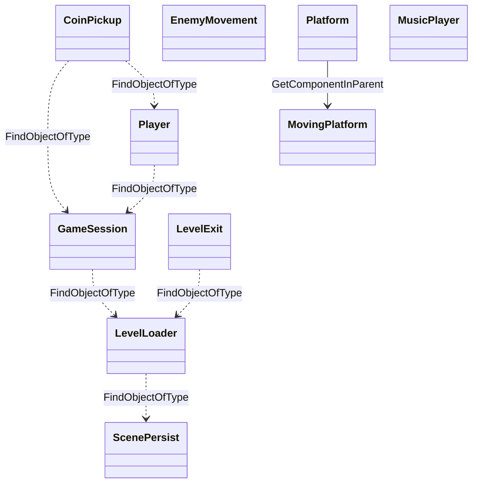
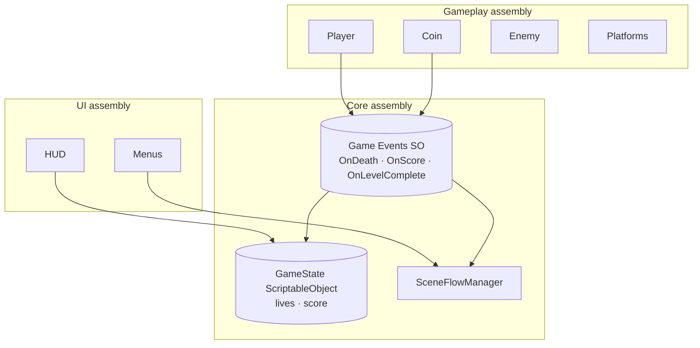

# Codebase Architecture & Code Review

> **Purpose:** Architecture-at-a-glance, strengths, weaknesses, concrete technical-debt defects and the suggested target architecture.
> **Owner:** Franco Fusaro · **Status:** Baseline (as-built) · **Last Updated:** 2026-07-10
> **Related:** [../Architecture](../Architecture.md), [../../production/KnownRisks](../../production/KnownRisks.md), [../../production/Backlog](../../production/Backlog.md)

Scope: 16 custom scripts in `Assets/Scripts/` (703 LOC). Vendored `Standard
Assets` and `TextMesh Pro` are excluded from quality scoring (third-party).

## Architecture at a glance

- **Paradigm:** flat MonoBehaviour components; no namespaces, no interfaces, no
  base classes, no ScriptableObjects, no assembly definitions.
- **Wiring:** runtime discovery via `FindObjectOfType<T>()` (11 call sites across
  the codebase) + `[SerializeField]` inspector references.
- **State:** `GameSession` (lives/score), `PlayerPrefs` (volume). No save file.
- **Communication:** direct method calls after discovery; **no events/delegates**.
- **Persistence:** duplicate-destroying `DontDestroyOnLoad` singletons.

There is **no dependency graph by design** — the discovery pattern hides a fully
connected, implicit web of dependencies.

---

## ✅ Strengths

1. **Readable, small methods.** `Player.cs` decomposes behavior into
   intention-revealing methods (`PlayerIsOnGround`, `PlayerHasHorizontalSpeed`).
   This is genuinely good and beginner-friendly.
2. **Named constants over magic strings** in `Player.cs` (layer/animation names as
   `const string`) — better than inline literals elsewhere.
3. **`[SerializeField]` for tuning** — speeds, jump force, score value, delays are
   all inspector-exposed rather than hardcoded in logic.
4. **Cached component references** in `Player`/`Enemy` (`GetComponent` in `Start`,
   not `Update`) — the right pattern.
5. **Cinemachine + TextMeshPro + Tilemap** — uses the correct modern-for-2018
   subsystems rather than reinventing them.
6. **PlayerPrefs wrapper** (`PlayerPrefsController`) centralizes keys and clamping —
   a reasonable seam.

## ⚠️ Weaknesses

1. **`FindObjectOfType` everywhere, including per-frame.** `OptionsControllers.Update`
   calls `FindObjectOfType<MusicPlayer>()` **every frame**; `CoinPickup`,
   `LevelExit`, `Player.ProcessDeath` call it on events. It's O(n) over all scene
   objects and returns unpredictable results with multiple instances.
2. **No namespaces.** All 16 types sit in the global namespace — collision-prone
   and un-modular.
3. **Type-based identity checks.** `CoinPickup` treats "collider is a
   `CapsuleCollider2D`" as "is the player." `EnemyMovement` treats "trigger exited a
   `Tilemap`" as "at an edge." Both are brittle proxies for real identity.
4. **Inconsistent singletons.** Three near-identical hand-rolled singletons
   (`GameSession`, `ScenePersist`, `MusicPlayer`, plus `MenuMusic`) with subtly
   different code. No shared base.
5. **Dead / stubbed code.** Difficulty slider commented out across
   `OptionsControllers`; `MovingPlatform.Destroy` branch unreachable; `ScenePersist`
   stores `startingSceneIndex` but never uses it; empty `Start`/`Update` bodies.
6. **Bugs baked into logic** (see Technical Debt).
7. **Spelling/naming inconsistency.** `startMovingOnPlayerCollsion` (typo),
   `OptionsControllers` (plural), mixed `PascalCase`/`camelCase` for serialized
   fields (`walkSpeed` vs `SecondsToReloadOnDeath` vs `LevelLoadDelay`).

## 🧨 Technical Debt (concrete defects)

| # | Location | Defect | Severity |
|:-:|----------|--------|:--------:|
| 1 | `LevelLoader.NextLevel` / `LoadMainMenu` | `Destroy(FindObjectOfType<ScenePersist>())` then a **second** `FindObjectOfType<ScenePersist>()` that can be `null` → `NullReferenceException` | High |
| 2 | `LevelLoader.LoadYouLoseScene` | Loads `"LoseScreen"` — **scene doesn't exist** | High |
| 3 | `PlayerPrefsController.SetDifficulty` | Copy-paste bug: calls `SetMasterVolume(...)` instead of setting difficulty; clamps to volume range | Medium |
| 4 | `Player.Jump` | `velocity += (0, jumpSpeed)` (adds instead of sets) → inconsistent jump height | Medium |
| 5 | `Platform.OnTriggerStay2D` | Re-parents **any** collider every frame; couples player scale to platform; jitter | Medium |
| 6 | `CoinPickup` / `LevelExit` | No player check → any/ wrong collider triggers pickup/level-advance | Medium |
| 7 | `GameSession` HUD refs | Serialized TMP refs may go stale across scenes (singleton survives, scene UI doesn't) | Medium |
| 8 | `MovingPlatform` | Empty `Start`; unreachable `Destroy` branch | Low |
| 9 | `OptionsControllers.defaultVolume` marked `[SerializeField] public static` | `static` fields are **not** serialized by Unity — the attribute is a no-op | Low |

## 🔁 Refactoring Opportunities

| Recommendation | Why | Effort | Benefit | Priority |
|----------------|-----|:------:|:-------:|:--------:|
| Introduce a `Singleton<T>` base or a lightweight service locator | Removes 4 duplicated singleton bodies; single source of truth | S | Medium | **High** |
| Cache manager references (event/`Awake` lookups) instead of per-call `FindObjectOfType` | Perf + correctness | S | Medium | **High** |
| Add a `PlayerTag`/`IPlayer` marker and check it in all triggers | Fixes bugs #6 | S | High | **High** |
| Extract `SceneFlowManager` with named-scene constants + bounds checks | Fixes bugs #1, #2; kills index fragility | M | High | **High** |
| Wrap the game state in a `ScriptableObject` (lives/score) | Decouples HUD from `GameSession` lifecycle; fixes #7 | M | High | Medium |
| Event system (C# events or `UnityEvent`/SO events) for score/death/level-complete | Removes discovery web | M | High | Medium |
| Player state machine (grounded/climbing/dead) | `Update` is a flat sequence of `if`s; a state machine clarifies and enables new states | M | Medium | Medium |
| Add assembly definitions + namespaces | Compile times, modularity, testability | S | Medium | Medium |

## 🏛️ Architectural Risks

1. **Implicit global coupling** — every system reaches into every other via
   discovery; refactors ripple unpredictably. (See `docs/production/KnownRisks.md`.)
2. **Scene-order coupling** — build index math is load-bearing and undocumented in code.
3. **Lifecycle mismatch** — persistent managers hold scene-scoped references.
4. **No test seams** — statics, `FindObjectOfType`, and MonoBehaviour coupling make
   unit testing effectively impossible today.

## 🧭 Suggested Future Architecture

- **ScriptableObject state + events** decouple producers (Player/Coin) from
  consumers (HUD/SceneFlow) — the idiomatic modern Unity pattern and a natural,
  incremental migration from the current code.
- **Assembly definitions** (`Core`, `Gameplay`, `UI`) enforce dependency direction
  and unlock EditMode/PlayMode tests.
- **New Input System** replaces vendored CrossPlatformInput.

Estimated effort to reach this target from today: **~2–4 focused days** given the
codebase is only 703 LOC. Sequencing is in `docs/technical/Architecture.md`.

## SOLID / smell scorecard

| Principle | Rating | Note |
|-----------|:------:|------|
| Single Responsibility | 🟡 | `Player` and `LevelLoader` do several things; most others are focused |
| Open/Closed | 🔴 | New enemy/mechanic types require editing existing classes; no polymorphism |
| Liskov | ⚪ | N/A — no inheritance |
| Interface Segregation | 🔴 | No interfaces at all |
| Dependency Inversion | 🔴 | Everything depends on concretes via `FindObjectOfType` |
| Cohesion | 🟢 | Files are small and cohesive |
| Coupling | 🔴 | High, implicit, global |
