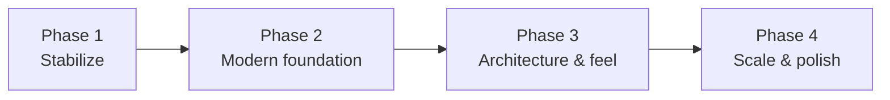

# Executive Summary — CatPlatformer Technical Assessment

> **Purpose:** Point-in-time health scorecard and effort estimate for the inherited legacy project (as-built assessment).
> **Owner:** Franco Fusaro · **Status:** Baseline (as-built) · **Last Updated:** 2026-07-10
> **Related:** [CodeReview](CodeReview.md), [../../production/Roadmap](../../production/Roadmap.md), [../../production/KnownRisks](../../production/KnownRisks.md)

**Project:** CatPlatformer — a 2D cat platformer · **Engine:** Unity 2018.3.0f2 ·
**Target:** WebGL · **Version:** 0.1 · **Author:** Franco Fusaro (sole contributor)
· **Codebase:** 16 scripts, 703 LOC.

## Overall project health: **6 / 10**

A clean, functional, small-scope hobby platformer that *works* and demonstrates
solid Unity fundamentals — held back by an outdated engine, a discovery-based
architecture that won't scale, a deprecated input dependency, and a handful of
concrete latent bugs. Because it is so small, it is **cheap to modernize**, which
is its biggest opportunity.

## Scorecard

| Dimension | Score | Rationale |
|-----------|:-----:|-----------|
| **Gameplay quality** | 6/10 | Core loop works; movement is stiff (no coyote/buffer/variable jump), one-hit-kill, level-restart-only respawns |
| **Code quality** | 6/10 | Readable, small, well-named methods; but no namespaces/interfaces/tests and pervasive `FindObjectOfType` |
| **Architecture quality** | 4/10 | Flat MonoBehaviours wired by runtime discovery; hidden global coupling; no events/DI/SO |
| **Asset organization** | 7/10 | Sensible folders, clear categories; some leftover/duplicate art, unverified licenses |
| **Technical debt** | 5/10 | Low volume of code but several real defects + dead code + stubbed features |
| **Modernization readiness** | 7/10 | Tiny surface area → fast to upgrade; stable APIs; main friction is input + engine jump |

## Technical debt highlights
- `LoseScreen` scene referenced but **missing** (`LevelLoader`).
- Double `FindObjectOfType` after `Destroy` → **NRE risk** in level teardown.
- `PlayerPrefsController.SetDifficulty` writes volume (copy-paste bug); difficulty stubbed out.
- Fragile identity checks (coin = "any capsule", exit/platform = "any collider").
- Jump *adds* velocity → inconsistent height.
- Unused Ads/Analytics/IAP packages + many unused engine modules.

## Estimated effort to modernize
- **Bug fixes + cleanup (Phase 1):** ~1–2 days
- **LTS upgrade + Input System (Phase 2):** ~3–5 days
- **Architecture (SO state + events + asmdefs) + jump feel (Phase 3):** ~1 week
- **Long-term (state machine, save system, URP, CI/tests) (Phase 4):** ongoing
- **To a solid, maintainable, modern baseline:** **~2 weeks of focused work.**

## Biggest risks
1. **Hidden global coupling** (`FindObjectOfType` everywhere) — refactors break silently.
2. **Unsupported engine + deprecated input** — longevity/tooling liability.
3. **Latent scene-flow bugs** (missing scene, teardown NRE, index coupling).
4. **Licensing** of third-party art/music is unverified; no LICENSE file.

## Highest-value improvements
1. **Jump-feel overhaul** (coyote time, buffering, variable height) — biggest fun-per-hour.
2. **Fix the concrete bugs** (LoseScreen, teardown NRE, difficulty, identity checks) — cheap correctness.
3. **ScriptableObject state + events** — removes the coupling that blocks everything else.
4. **Real HP + hearts UI + checkpoints** — depth and fairness (art partly exists).
5. **LTS + Input System upgrade** — future-proofing.

## Recommended next steps
1. Read `docs/technical/baseline/CodeReview.md` and `docs/production/KnownRisks.md`, then knock out the
   Phase 1 quick wins on a branch.
2. Decide the target Unity LTS (see `docs/technical/baseline/DependencyAudit.md`) and do the upgrade
   in isolation with a full playtest of all 4 levels.
3. Adopt the ScriptableObject + events backbone from `docs/technical/baseline/CodeReview.md` before
   adding new mechanics.
4. Establish GameCI + a couple of EditMode tests so future changes are protected.

---

## Prioritized Roadmap

### Phase 1 — Stabilize (1–2 days)
- Fix `LoseScreen`, teardown NRE, `SetDifficulty`, jump `+=`→`=`.
- Add player-identity checks to coin/exit/platform triggers.
- Cache `LayerMask` ints and manager references; kill per-frame `FindObjectOfType`.
- Remove dead code + unused packages/modules; add a LICENSE; verify asset licenses.

### Phase 2 — Modern foundation (3–5 days)
- Upgrade to a supported Unity **LTS**.
- Migrate input from CrossPlatformInput → **Input System**.
- Swap vendored 2d-extras for `com.unity.2d.tilemap.extras`.
- Add **assembly definitions + namespaces** (`Core`/`Gameplay`/`UI`).

### Phase 3 — Architecture & feel (~1 week)
- **ScriptableObject** game state (lives/score) + **event** system for death/score/level-complete.
- `Singleton<T>` base / service locator; `SceneFlowManager` with named scenes.
- **Jump-feel** package + **checkpoints** + **HP/hearts** UI.
- Pool coin SFX / add an AudioManager.

### Phase 4 — Scale & polish (ongoing)
- Player **state machine**; enemy base class + `IDamageable`.
- **Save system**; **AudioMixer**; **URP 2D** lighting (day/night art already exists).
- **CI/CD** (GameCI → WebGL), EditMode/PlayMode **tests**, profiling baseline.
- Localization & accessibility (rebinding, difficulty, colorblind hazard cues).

