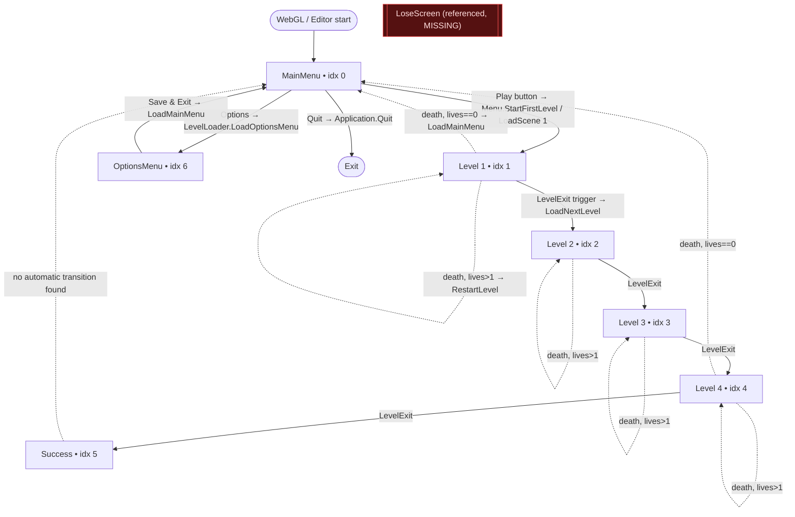
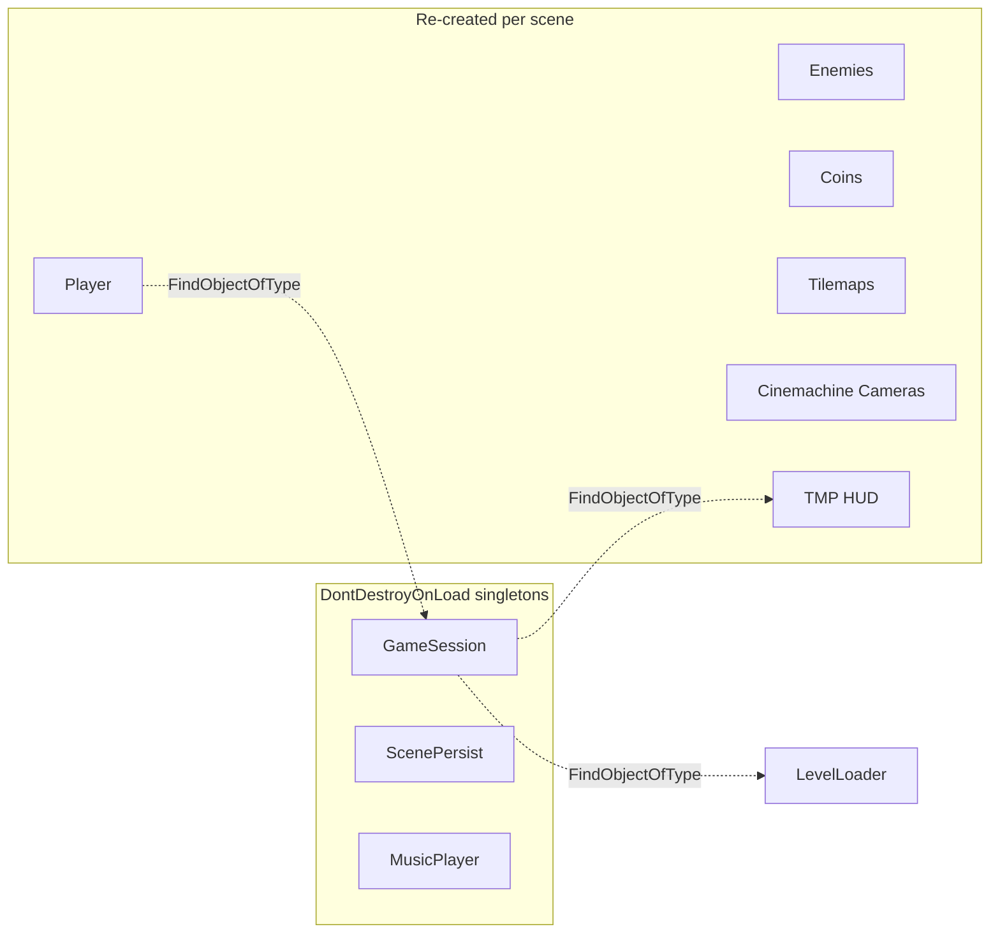
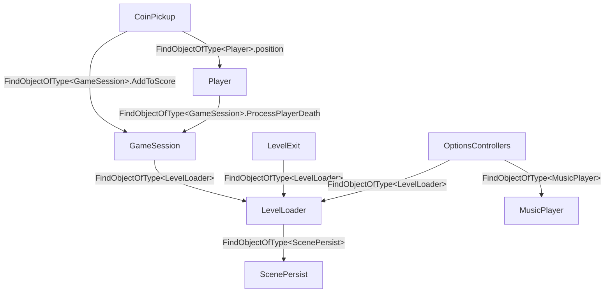

# Level & Scene Architecture

> **Purpose:** As-built scene list, build-index flow, persistence singletons and inter-object communication of the legacy game.
> **Owner:** Franco Fusaro · **Status:** Baseline (as-built) · **Last Updated:** 2026-07-10
> **Related:** [../SceneManagement](../SceneManagement.md), [CodeReview](CodeReview.md)

## Scenes (build order)

From `ProjectSettings/EditorBuildSettings.asset` — **order is load-bearing** because
`LevelLoader` navigates by build index (`currentSceneIndex + 1`).

| Build Index | Scene | Role |
|:-:|-------|------|
| 0 | `MainMenu` | Title / start / options entry |
| 1 | `Level 1` | First playable level |
| 2 | `Level 2` | Playable |
| 3 | `Level 3` | Playable |
| 4 | `Level 4` | Playable (last level) |
| 5 | `Success` | Win screen (reached after Level 4 exit) |
| 6 | `OptionsMenu` | Volume/settings |

> ⚠️ `LevelLoader.LoadYouLoseScene()` loads a scene named **`LoseScreen`**, which
> **does not exist** in `Assets/Levels/`. Calling it would throw. It appears to be
> currently unreferenced (no caller found), but it is a latent bug.

## Scene Flow



## Level Loading Lifecycle

```mermaid
sequenceDiagram
    participant P as Player
    participant LE as LevelExit
    participant LL as LevelLoader
    participant SP as ScenePersist
    participant SM as SceneManager

    P->>LE: OnTriggerEnter2D (reaches exit)
    LE->>LL: LoadNextLevel()
    LL->>LL: StartCoroutine(NextLevel)
    LL->>LL: Time.timeScale = 0.2 (slow-mo)
    Note over LL: WaitForSecondsRealtime(2s)
    LL->>LL: Time.timeScale = 1
    LL->>SP: Destroy(ScenePersist) then SetActive(false)
    Note over LL,SP: ⚠ second FindObjectOfType may be null → NRE risk
    LL->>SM: LoadScene(currentIndex + 1)
    SM-->>P: New scene loaded; persistent managers survive
```

## Persistent Objects (survive scene loads)

Three objects use `DontDestroyOnLoad` + "destroy the duplicate on Awake":

| Object | Script | Carries |
|--------|--------|---------|
| `GameSession` | `GameSession.cs` | lives, score, HUD text refs |
| `ScenePersist` | `ScenePersist.cs` | marks a scene as "already entered" (index stored but unused) |
| `MusicPlayer` | `MusicPlayer.cs` | continuous music across scenes |



### Singleton pattern notes
- The pattern is **duplicate-destroying**, not classic static-instance. Each has its own copy of:
  ```csharp
  if (FindObjectsOfType<T>().Length > 1) Destroy(gameObject);
  else DontDestroyOnLoad(gameObject);
  ```
- **Risk:** `GameSession` holds serialized references to `livesText`/`scoreText`
  (TMP objects that live in each *scene*). Because the original `GameSession`
  survives scene loads, after the first scene its `livesText`/`scoreText` may point
  to **destroyed** objects, while the fresh scene's duplicate `GameSession` is
  destroyed by the singleton guard. This means **HUD updates after the first level
  can target stale references** unless each level re-wires them — a subtle,
  scene-order-dependent fragility. **(ASSUMPTION — depends on how prefabs are placed per scene; verify in editor.)**

## Inter-Scene / Inter-Object Communication

There is **no event bus and no scene message passing**. All communication is
runtime discovery:



This makes scenes self-sufficient (each contains its own manager prefabs) but
means every interaction pays a scene-scan cost and breaks silently if a manager
is missing from a scene.

## Additive scenes / async loading
- **None.** All loads are single-scene synchronous `SceneManager.LoadScene(...)`.
- No `LoadSceneMode.Additive`, no `LoadSceneAsync`, no loading screens.

## Manager placement per scene (VERIFIED from scene files)

Resolved by grepping each `.unity` file for the manager prefab GUIDs. A ✓ means the
scene **references** that prefab's GUID (instantiated instance or a component
reference such as a Cinemachine follow target).

| Manager | MainMenu | L1 | L2 | L3 | L4 | Success | Options |
|---------|:--:|:--:|:--:|:--:|:--:|:--:|:--:|
| GameSession | ✓ | ✓ | ✓ | ✓ | ✓ | — | ✓ |
| LevelLoader | ✓ | ✓ | ✓ | ✓ | ✓ | ✓ | ✓ |
| ScenePersist | — | ✓ | ✓ | ✓ | ✓ | — | — |
| MusicPlayer | ✓ | ✓ | — | — | — | — | — |
| Cameras | ✓ | ✓ | ✓ | ✓ | ✓ | ✓ | ✓ |
| Player (ref) | ✓ | ✓ | ✓ | ✓ | ✓ | ✓ | ✓ |
| OptionsController | — | — | — | — | — | — | ✓ |

**Confirmed findings:**
- **GameSession is placed in `MainMenu`** (and every scene except `Success`). Because
  it is a `DontDestroyOnLoad` duplicate-destroying singleton, **the MainMenu instance
  is the one that persists** into gameplay; every later scene's `GameSession`
  duplicate self-destroys on `Awake`. Its serialized `livesText`/`scoreText` therefore
  point at **MainMenu's** UI objects, which are destroyed on scene change → **R4
  (stale HUD refs) is confirmed as a real structural hazard**, not just a hypothesis.
  (MainMenu contains 11 MonoBehaviour/TMP entries, so the wiring exists there.)
- **MusicPlayer only exists in MainMenu + Level 1.** Fine in normal play (it persists
  from the menu), but **starting directly in Level 2–4 in the editor yields no music.**
- **`Success` has no GameSession** → the win screen cannot show final score with the
  current setup (score isn't carried there anyway; see gameplay doc).
- **`MenuMusic.cs` script GUID appears in no scene or prefab → it is dead/unused code.**
- `ScenePersist` correctly exists only in the four gameplay levels.

## TODO (remaining, needs Play-mode confirmation)
- [ ] Confirm in Play mode whether MainMenu's `GameSession.Start()` NREs on `livesText`
      if MainMenu has no HUD text assigned (potential startup bug).
- [ ] Confirm how `Success` returns to the menu (button vs. script).
- [ ] Confirm `VerticalScroll`/`LayerParallax` `viewTarget` wiring per level (inspector-only data).
